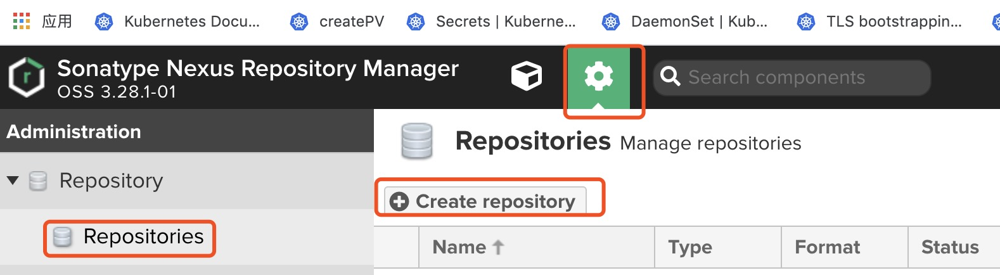
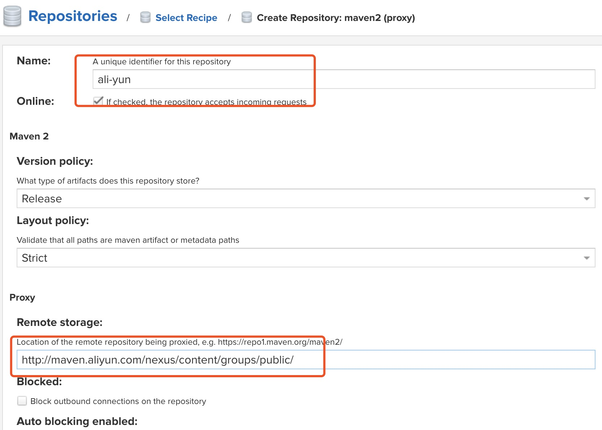
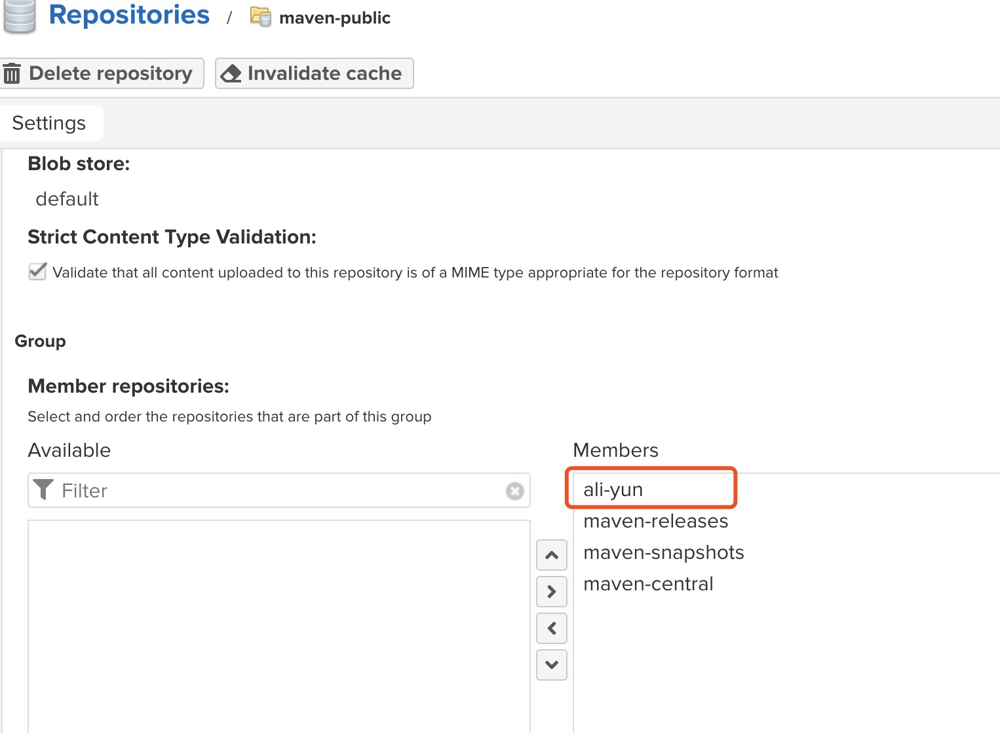
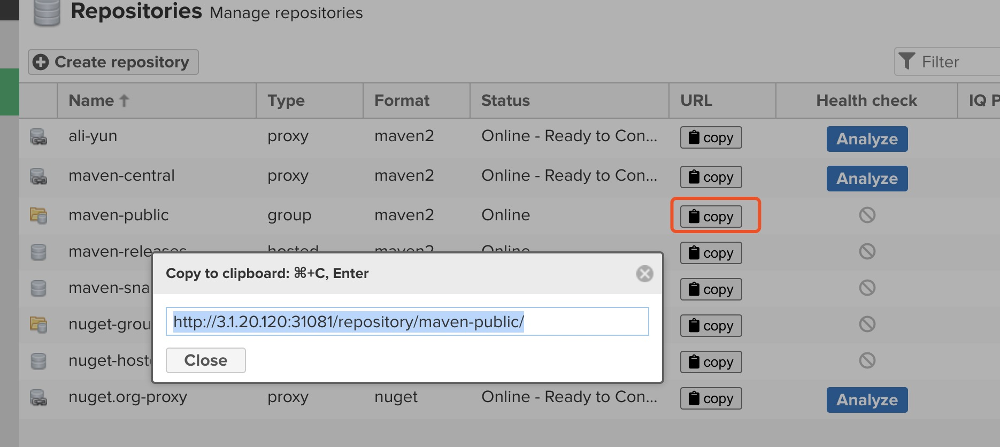
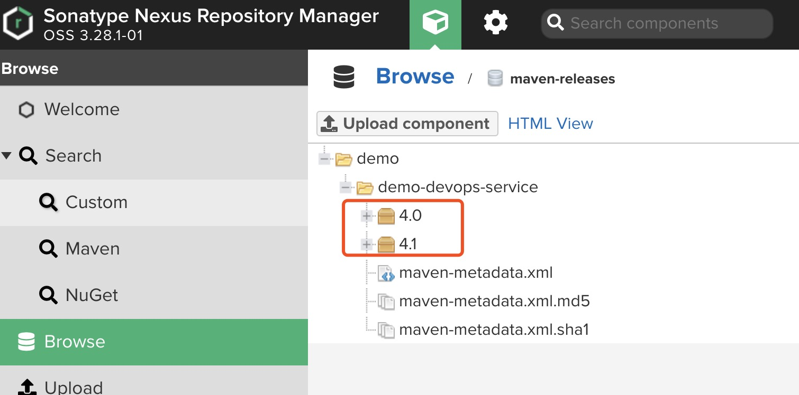

# comment

## 1. 介绍

指定私服的中央地址、将自己的Maven项目指定到私服地址、从私服下载中央库的项目索引、从私服仓库下载依赖组件、将第三方项目jar上传到私服供其他项目组使用

仓库：
　　　hosted   类型的仓库，内部项目的发布仓库　
　　　releases 内部的模块中release模块的发布仓库
　　　snapshots 发布内部的SNAPSHOT模块的仓库　　
　　　3rd party 第三方依赖的仓库，这个数据通常是由内部人员自行下载之后发布上去　
　　　proxy   类型的仓库，从远程中央仓库中寻找数据的仓库
　　　group   类型的仓库，组仓库用来方便我们开发人员进行设置的仓库


## 2. 启动

rbac 不用nexus和k8s联动，可以不创建
```yaml
---
apiVersion: v1
kind: ServiceAccount
metadata:
  name: nexus3 
  namespace: devops
  labels:
    app-name: nexus

---
apiVersion: rbac.authorization.k8s.io/v1beta1
kind: ClusterRole
metadata:
  name: nexus3
rules:
  - apiGroups: [""] # "" indicates the core API group
    resources:
      - services
      - endpoints
      - pods
      - deployments
      - nodes
    verbs:
      - get
      - watch
      - list
  - apiGroups:
      - extensions
    resources:
      - ingresses
    verbs:
      - get
      - watch
      - list
  - nonResourceURLs: ["/metrics"]
    verbs:
      - get

---
kind: ClusterRoleBinding
apiVersion: rbac.authorization.k8s.io/v1
metadata:
  name: nexus3-crb
subjects:
- kind: ServiceAccount
  name: nexus3
  namespace: devops
roleRef:
  kind: ClusterRole
  name: nexus3
  apiGroup: rbac.authorization.k8s.io
```

pvc 默认集群中已经有default storageclass
```yaml
---
kind: PersistentVolumeClaim
apiVersion: v1
metadata:
  name: nexus-data-pvc
  namespace: devops
spec:
  accessModes:
   - ReadWriteOnce
  resources:
    requests:
      storage: 5Gi
```

deployment
```yaml
apiVersion: apps/v1
kind: Deployment
metadata:
  name: nexus3 
  namespace: devops
  labels:
    app-name: nexus3
spec:
  replicas: 1 
  selector:
    matchLabels:
      app-name: nexus3
  strategy:
    type: RollingUpdate
    rollingUpdate:
      maxSurge: 1
      maxUnavailable: 0
  template:
    metadata:
      labels:
        app-name: nexus3
    spec:
      securityContext:
        fsGroup: 1000
        runAsUser: 0
      hostname: nexus3
#      hostAliases:
#      - ip: 127.0.0.1
#        hostnames:
#        - "nexus3.js.sgcc.com.cn"
      #serviceAccount: nexus3
      containers:
      - name: nexus3
        image: sonatype/nexus3
        imagePullPolicy: IfNotPresent
        ports:
        - containerPort: 8081
          name: web
          protocol: TCP
        volumeMounts:
        - name: nexus-data
          mountPath: /nexus-data
        - name: localtime
          mountPath: /etc/localtime
        - name: hosts
          mountPath: /etc/hosts
      volumes:
      - name: nexus-data
        persistentVolumeClaim:
          claimName: nexus-data-pvc
      - name: localtime
        hostPath:
          path: /etc/localtime
      - name: hosts
        hostPath:
          path: /etc/hosts
```

svc
```yaml
apiVersion: v1
kind: Service
metadata:
  name: nexus3
  namespace: devops
  labels:
    app-name: nexus3

spec:
  selector:
    app-name: nexus3
  ports:
  - name: nexus3
    port: 80
    targetPort: 8081
    nodePort: 31081
  type: NodePort
```

## 3. 配置nexus

检查是否启动成功
```bash
[root@node1 03_nexus3]# kubectl get pod -n devops
NAME                       READY   STATUS    RESTARTS   AGE
getfile-d56c4b494-jhczb    1/1     Running   1          101m
gitlab-7c5f6b8f76-79k5m    1/1     Running   0          3h58m
jenkins-7db8dc5b66-q4kvt   1/1     Running   0          3h30m
```

访问 http://3.1.20.120:31081/

接下来我们增加一个代理仓库，使用的是阿里云公共仓库。首先点击“Create repository”按钮开始创建一个仓库：


类型选择 maven2（proxy）
配置阿里云地址 http://maven.aliyun.com/nexus/content/groups/public/，name 可以自己定义


阿里云代理仓库创建完毕后，我们编辑 maven-public，将其添加到放入 group 中，并调整优先级，然后保存：


点击 maven-public 条目的 copy 按钮即可拷贝私服地址：


## 4. 配置maven

### 4.1 安装jdk

```bash
yum install java-devel
```

### 4.2 安装maven
当我们在 maven 使用 maven-public 仓库地址的时候，会按照如下顺序访问：本地仓库 --> 私服 maven-releases --> 私服 maven-snapshots --> 远程阿里云 maven 仓库 --> 远程中央仓库。

```bash
wget http://mirrors.hust.edu.cn/apache/maven/maven-3/3.3.9/binaries/apache-maven-3.3.9-bin.tar.gz
tar -xvf  apache-maven-3.3.9-bin.tar.gz
sudo mv -f apache-maven-3.3.9 /usr/local/
```
编辑 **/etc/profile** 文件 **sudo vim /etc/profile**，在文件末尾添加如下代码：

```bash
export MAVEN_HOME=/usr/local/apache-maven-3.3.9
export PATH=${PATH}:${MAVEN_HOME}/bin

```

检查
```bash
source /etc/profile
mvn -v
```

配置seting.xml

vi /usr/local/apache-maven-3.3.9/conf/settings.xml  servers配置中添加如下两段,用来java中pom.xml提交是的用户名密码验证
```xml
    <server>
        <id>releases</id>
        <username>admin</username>
        <password>123456</password>
    </server>
    <server>
        <id>snapshots</id>
        <username>admin</username>
        <password>123456</password>
    </server>
```


pom.xml中配置
> ```xml
> <distributionManagement>
>    <repository>
>        <id>releases</id>
>        <name>Releases</name>
>        <url>http://192.168.60.133:8081/repository/maven-releases/</url>
>    </repository>
>    <snapshotRepository>
>        <id>snapshots</id>
>        <name>Snapshot</name>
>        <url>http://192.168.60.133:8081/repository/maven-snapshots/</url>
>    </snapshotRepository>
></distributionManagement>
>```

至此，java源码`mvn clean deploy`之后就可以在release中看到相关jar包


## 备注

`mvn clean package`依次执行了clean、resources、compile、testResources、testCompile、test、jar(打包)等７个阶段。
`mvn clean install`依次执行了clean、resources、compile、testResources、testCompile、test、jar(打包)、install等8个阶段。
`mvn clean deploy`依次执行了clean、resources、compile、testResources、testCompile、test、jar(打包)、install、deploy等９个阶段。

分析解释如下：
package命令完成了项目编译、单元测试、打包功能，但没有把打好的可执行jar包（war包或其它形式的包）布署到本地maven仓库和远程maven私服仓库
install命令完成了项目编译、单元测试、打包功能，同时把打好的可执行jar包（war包或其它形式的包）布署到本地maven仓库，但没有布署到远程maven私服仓库
deploy命令完成了项目编译、单元测试、打包功能，同时把打好的可执行jar包（war包或其它形式的包）布署到本地maven仓库和远程maven私服仓库　