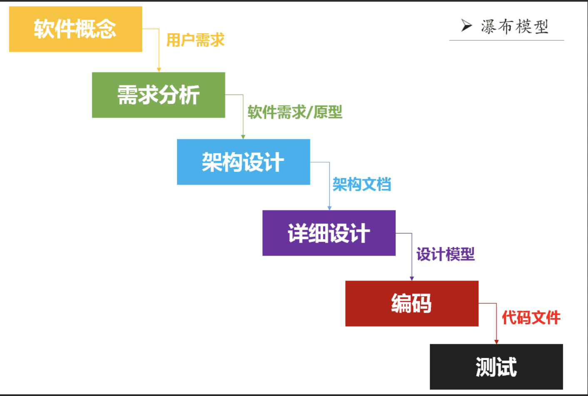
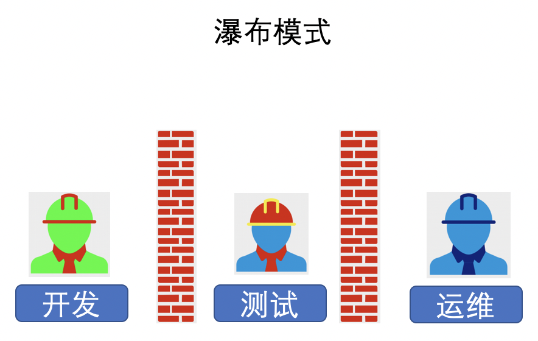
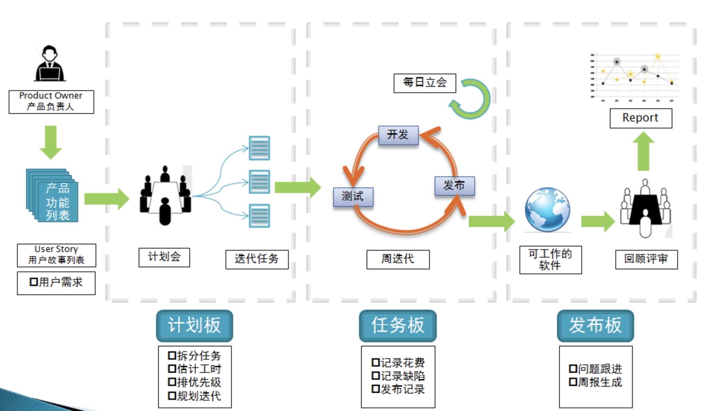
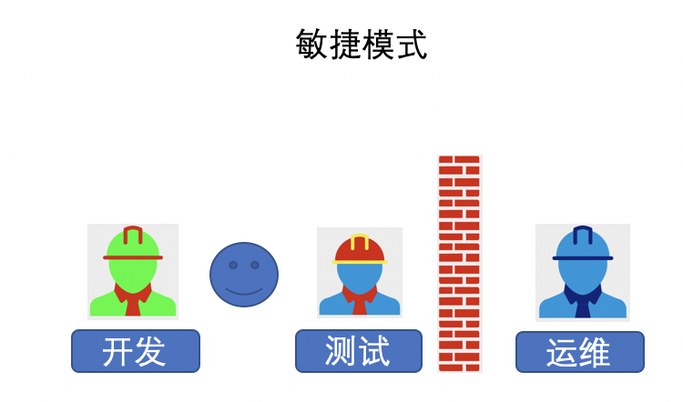
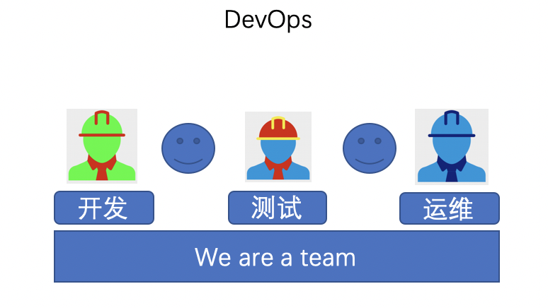

# content
- [content](#content)
- [1. DevOps是什么](#1-devops是什么)
  - [1.1 盲人摸象](#11-盲人摸象)
  - [1.2 软件开发模式](#12-软件开发模式)
    - [1.2.1 瀑布开发模式](#121-瀑布开发模式)
    - [1.2.2 敏捷开发模式](#122-敏捷开发模式)
    - [1.2.3 DevOps](#123-devops)
  - [1.3 DevOps理解](#13-devops理解)

> 几个问题:
>
> - DevOps解决的是什么问题？
>
> - DevOps平台和自动化运维平台是一回事吗？
> - DevOps平台和持续交付是什么关系？
> - DevOps工程师有哪些技能要求？
> - 如何证明企业已经做到了DevOps

# 1. DevOps是什么

百度百科

> DevOps（Development和Operations的组合词）是一组过程、方法与系统的统称，用于促进开发（应用程序/软件工程）、技术运营和质量保障（QA）部门之间的沟通、协作与整合。
>
> 它是一种重视“软件开发人员（Dev）”和“IT运维技术人员（Ops）”之间沟通合作的文化、运动或惯例。透过自动化“软件交付”和“架构变更”的流程，来使得构建、测试、发布软件能够更加地快捷、频繁和可靠。

维基百科

>
>
>

## 1.1 盲人摸象

DevOps之父Patrick第一次参加DevOpsDays中国站活动的时候，使用了`盲人摸象`的比喻。这说明不同的人从自己的专业角度，对DevO
ps的理解各不相同，但是又想从自己的专业角度、经验去推测DevOps的全貌。最后可想而知DevOps的标注无法统一，理解也千差万别。

就像一阵风，DevOps呼啸而至。让我们觉得不去理解它，不去实践它就立马被淘汰。从而造成一种现象，给人的感觉是当前的各种问题都是因为没有做到DevOps而造成的。而高效率，高质量的团队肯定是一个DevOps的团队。

于是，这种`盲人摸象`式的论调指导着不同的DevOps声音，更有“DevOps就是要干掉运维","运维人员要前面转着做开发“的负面声音，这给很多IT从业人员一度很焦虑。

那么DevOps是什么？我想与其纠结DevOps是什么，还不如让我们思考DevOps究竟要解决什么问题。如果要想了解DevOps是什么，那么我们还得从软件工程的发展来看

## 1.2 软件开发模式

### 1.2.1 瀑布开发模式

瀑布式开发模式将软件交付过程划分成几个阶段，大致分为需求、开发、测试、和运维。它的理念是软件开发必须以一种工程管理的方式来定义每个阶段，以及每个阶段的交付产物和交付标准，以期通过一种重流程，重管控，按照计划一步步推进整个项目的交付过程。

可是，这种方式需要在项目一开始就确定项目目标、范围以及实现方式，而这个时间点往往是我们对用户和市场环境信息了解最少的时候，这样作出的决策往往带有很大的不确定性，很容易导致项目范围不断变更，计划不断延期，最后的结果是，即便我们投入了大量资源，却难以达到预期效果。

而其流程化的模式最终的团队关系会如下

### 1.2.2 敏捷开发模式

基于瀑布模型的一些问题，敏捷的思潮开始盛行。既然我们开始阶段我们无法充分了解用户的真实需求是怎样的，那么不如将一个大目标不断拆解，把它变成一个个可交付的小目标，然后通过不断迭代，以小步快跑的方式开发。
如下图

图中我们可以看到测试从研发的末端注入到了整个开发活动中，对开发交付的内容进行持续验证，保证每次交付的都是一个可用的功能集合。所以敏捷是一种更灵活的研发模式。敏捷之所以更快，根本原因在于持续的迭代和验证节省了大量不必要的浪费和返工。

>思考：是不是所有的软件项目都适合敏捷开发模式？敏捷开发模式是缩短了瀑布模型中整个项目工期吗？

然而，在开发、测试打得火热的时候，运维人员却冷眼旁观的在旁边。即使输出了可工作的软件，运维人员也不乐意去更新自己现在运维的系统，因为变更是运维人员最不想看到的。

这就好比，后厨经过买菜、洗菜、炒菜、试吃、再炒、再试吃...终于出了一盘美味佳肴，但是没有服务员帮你端上给顾客，那么这个就没有任何意义。

### 1.2.3 DevOps

基于敏捷开发思考之后，在墙的另一端的运维人员成了被和谐的对象，于是运维人员也被拉拢到这个团队，所以DevOps应运而生。这也是最早提出DevOps的初衷，就是要打破开发和运维之前的对立和隔阂。

对于时常“背锅”的运维团队，他们的考核指标往往是系统的稳定性、可用性、安全性，即使变更也要走很严格的流程。每一次上线都像一次战役，运维人员严格按照部署文档或者更新文档一步一步操作，等待上线之后，又屏住呼吸等待失败、错误、抱怨的降临。

运维上线之前甚至有运维团队拜服务器、拜神。

在无数次实践之后，运维人员发现，大多数的不稳定，错误来自上线变更。所以他们定义了发布窗口，和上线要求。只有不断的降低发布窗口的频率，提高软件上线的要求才能使当前维护的系统能尽可能的稳定运行。

然而，当前我们所处的时代，机会转瞬即逝，产品更新的频率直接同软件产品和时代契合度相关。所以企业，公司领导不断要求运维人员提高发布窗口频率，降低上线要求。于是运维人员上线新产品，新功能，然后听天由命。

所以，大家大家都迫切得需要坐下来好好谈一谈，打破开发和运维之间的壁垒，创造一个高效和谐的团队是大家心中追求的目标。

> 当前DevOps普遍情况:
> 在以往的各种接触中，其实更像是运维拉开发测试团队入伙，在开发测试时，请加上运维的度量因素，测试真实环境下的场景，在此之上大家一起提高更新的频率和质量。

再此之上，大家又发现，其实这不仅仅是开发和运维的事，还应包含业务，产品，安全等。所以又有新的名词`BizDevOps`、`DevSecOps`等等。

## 1.3 DevOps理解
anyway，我们带着思考来理解这个模式，其实就是：借助平台工具，流程和人，打造一个高效，高质量，有持续改进能力的团队以便能快速交付价值，适应当前的时代浪潮。

此处我想我们应该能回答开头问题中的第一个问题了。

**DevOps解决的是什么问题？**
