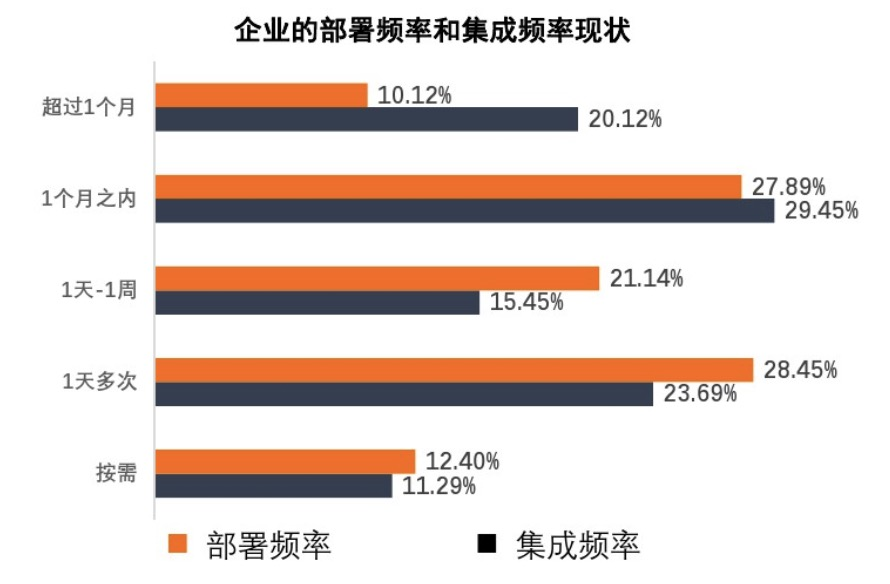
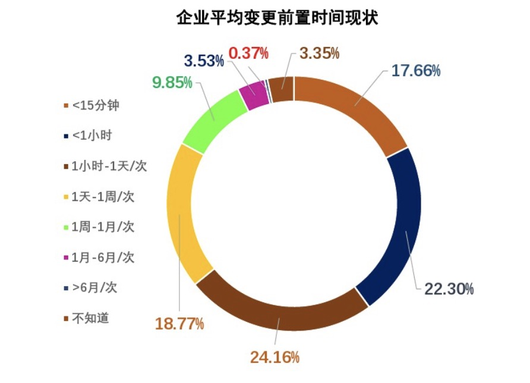

# comment
- [comment](#comment)
  - [1. 什么是数字化转型](#1-什么是数字化转型)
  - [2. must to have](#2-must-to-have)
  - [3. 四个指标](#3-四个指标)
  - [4. 团队创造力](#4-团队创造力)

## 1. 什么是数字化转型
>数字化转型是指通过利用现代技术和通信手段，改变企业为客户创造价值的方式。数字化转型（Digital transformation）是建立在数字化转换（Digitization）、数字化升级（Digitalization）基础上， 又进一步触及公司核心业务，以新建一种商业模式为目标的高层次转型。

以上定义来自`MBA智库百科`，那么用我们能理解的话来说：

 *数字化转型就是利用数字化技术（如，云计算，大数据，人工智能）来推动企业组织的业务模式，组织架构，企业文化等变革，从而衍生出智能制造，公共服务的智慧城市等概念*

 企业的财务、销售、市场等业务本身就有数据管理、数据分析的需求，所以我们往往提到企业的信息化就是相应的软件系统如财务系统、ERP、CRM等的实施和使用。但是这种信息化系统往往是支撑业务，提前定义好流程，满足管理的需求，所有的决策还是人为干预，系统之间也可能是孤立的，数据之间没有联系。

 但是我们现在提到的数字化不仅包含之前信息化系统，还要收集企业日常运营数据、客户使用产品的服务数据，当前市场行业趋势数据，竞争对手数据，热门热点数据等，从而形成企业日常运营全景图，反应从市场到产品研发，到服务流程改善，到销售模式改变，到精准营销的改进上来。

**企业如何做数字化转型？**

如果说近年来在制造行业中，公司战略中使用率最高的关键词，那么非`数字化转型`莫属。

大众今年宣布启动全面的数字化转型，计划到2023年年底投资约40亿美元，并且预计到2025年，大众集团的软件研发的比率将从目前的10%不到增加到60%

总体来说，企业数字化转型应该有如下阶段
|数据|信息|知识|智能|
|--|--|--|--|
|数据是基础，我们需要尽可能收集数据，当前收集数据设备相当多，包括我们已知的ERP、CRM等信息系统数据，还包括市场数据、设备传感器数据等，从而形成公司数据仓库|信息可视化，从数据的采集和治理后，我们需要基于业务需要的分析和可视化展示，从而让我们能够精确掌握各种信息数据|这个阶段我们要注重的是分析，包含传统的数据分析，大数据分析等，从第二阶段报表中总结出更能辅助决策知识，而不是报表的堆积，信息的汇总|全面转型的智能阶段，知识不仅仅是辅助决策了，而是真正进入到核心业务中，拉动生产，完成智能制造|

## 2. must to have

通过上面数字化转型的探讨，我们发现数字化转型的方法和步骤中，一直离不开一种东西，那就是**软件**，这不禁让人想起那句流传已久的名言“每家公司都将成为软件公司”。

移动互联网的兴起，深刻影响着我们的生活，我们现在在衣、食、住、行的各个方面都有所改变，似乎不依靠软件便无法生活。我们很难想象出门不带手机的情况.

软件已经不再是公司的支撑系统，而变成了业务的载体和利润的中心。企业完全可以通过公司软件系统提供优质的服务，并且能降低运营成本。

所以，不同公司之间的比拼就是公司信息化的比拼、数字化的比拼、时间的比拼。而这个核心就是信息化、数字化软件系统交付时间的比拼、交付质量的比拼。

然而，世间唯一不变的东西就是变化。我们处在一个模糊的、多变的世界。我们常常将其称之为“乌卡”时代，就是VUCA。
易变性（Volatility)
不确定性(Uncertainty)
复杂性(Complexity)
模糊性（Ambiguity)

企业能快速满足用户需求，在时代的大势之下灵活应对已经是一个“must to have"的能力了。可以说，软件交互的效率和质量是企业的核心竞争力。所以无论哪家公司都有强烈的愿望去改善自身软件系统的交付能力和质量，而DevOps的核心和理念也正是如此。通过DevOps赋能企业的软件制造（无论是甲方、还是软件提供商）是能在当前“乌卡”时代前进的一张船票。

## 3. 四个指标

DevOps在我们IT圈中口口向传，很难有人定义DevOps是个什么东西，最后都冠以“DevOps是一种理念“来结尾。不过在我们说过数字化之后，天上飞的东西最终都要落地，以”数据指标“的形式表现出来。DevOps中使用频率最高的四个指标是：
1. 部署频率：指应用和服务向生产环境不是代码的频率，如我们常说的多久发布一次
2. 变更前置时间：指代码从提交到成功运行在生产环境的时长，如一个commit提交，得等多长时间能在生产环境见到这个改动
3. 服务恢复时间：指线上应用和服务出现故障到恢复运行的时长
4. 变更失败率：指应用和服务在生产环境部署失败或者部署后导致服务降级的比率。

以下为2019年可信云统计的企业部署频率及前置时间

从图中我们可以看到，部署频率最高可以按需部署，最低得超过一个多月，相差数十百之多。
而前置时间最快小于15分钟，最大超过6个月，相差竟千倍之多。

经过分析我们可以发现，这四项指标，分别代表了软件交付的最重要两个方面：交付效率、交付频率。而上图两个指标可能有人会质疑，这么高频率的交付会不会影响质量，而通过各种信息和报告我们发现这种高效率交付的团队往往都是最火的公司，而且其软件质量也有目共睹，所以我们在获取效率的同时也可以获取质量。

若我们以以往的软件开发思维，软件需求要经过需求分析，软件开发，测试，集成测试，验收等流程那么显然是难以跟上节奏，甚至可能造成返工。所以我们要试图改变来满足这一市场需要，那么我们至少要从以下三个方面入手
- 1.研发实践的不断反馈
- 2.软件架构的整体革新
- 3.组织管理理念的不断升级
- 4.企业文化的不断塑造

## 4. 团队创造力

在以上我们的探讨中不断强调的是IT环境，思想，流程。然而并不是所有公司都是一样的环境，不同类型的公司似乎也有不同的流程。所以我们想要去搬一套行之有效的方法论来往公司套，试图将公司团队提到DevOps的高效团队，往往都会以失败而告终。

在这里面我们不会忽略了“人“这一关键要素。

我们在讨论“敏捷”、“CICD”、“高效管理方法”等等，其实都是在解决人的问题，或者说人与人配合的问题。如果我们引进了很多先进的系统，而我们的员工是排斥的，不愿意学习的，那么甚至还不如以前的效率。

所以，我们在用四个关键指标度量我们是否是高效团队的前提就是：我们是否有一个共享、互信、互助的富含创造力的团队。

个人人为这是做DevOps的第一道关就是要让团队明白：DevOps是为了提升团队人员的幸福水平。我们要通过各种工具、流程提升效率，能够平台工具做的坚决不用人做，以改变应对改变，拥抱变化，从而创造出我们自豪的产品。

