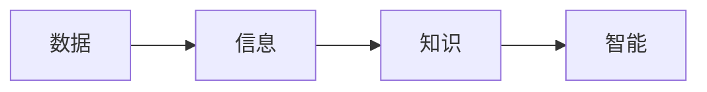

# content

## 1. 什么是数字化转型
>数字化转型是指通过利用现代技术和通信手段，改变企业为客户创造价值的方式。数字化转型（Digital transformation）是建立在数字化转换（Digitization）、数字化升级（Digitalization）基础上， 又进一步触及公司核心业务，以新建一种商业模式为目标的高层次转型。

以上定义来自`MBA智库百科`，那么用我们能理解的话来说：

 *数字化转型就是利用数字化技术（如，云计算，大数据，人工智能）来推动企业组织的业务模式，组织架构，企业文化等变革，从而衍生出智能制造，公共服务的智慧城市等概念*

 企业的财务、销售、市场等业务本身就有数据管理、数据分析的需求，所以我们往往提到企业的信息化就是相应的软件系统如财务系统、ERP、CRM等的实施和使用。但是这种信息化系统往往是支撑业务，提前定义好流程，满足管理的需求，所有的决策还是人为干预，系统之间也可能是孤立的，数据之间没有联系。

 但是我们现在提到的数字化不仅包含之前信息化系统，还要收集企业日常运营数据、客户使用产品的服务数据，当前市场行业趋势数据，竞争对手数据，热门热点数据等，从而形成企业日常运营全景图，反应从市场到产品研发，到服务流程改善，到销售模式改变，到精准营销的改进上来。

**企业如何做数字化转型？**

如果说近年来在制造行业中，公司战略中使用率最高的关键词，那么非`数字化转型`莫属。

大众今年宣布启动全面的数字化转型，计划到2023年年底投资约40亿美元，并且预计到2025年，大众集团的软件研发的比率将从目前的10%不到增加到60%

总体来说，企业数字化转型应该有如下阶段
