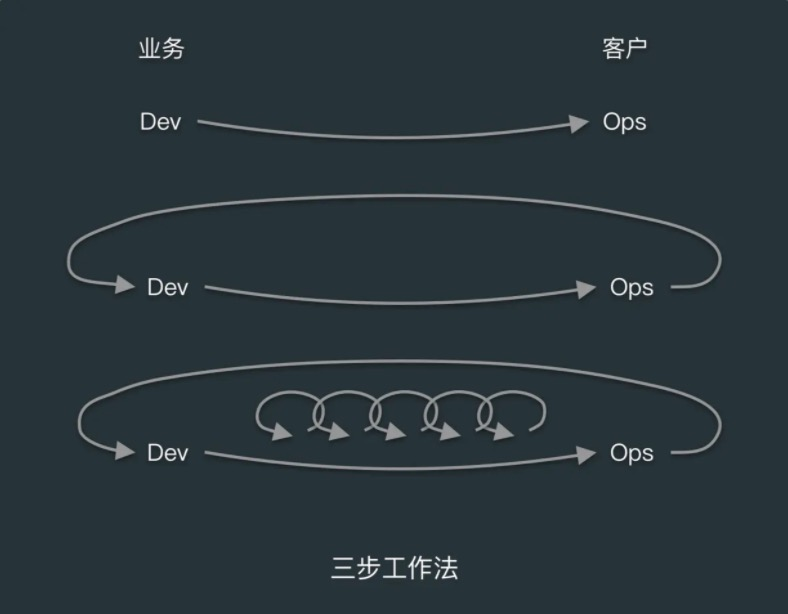
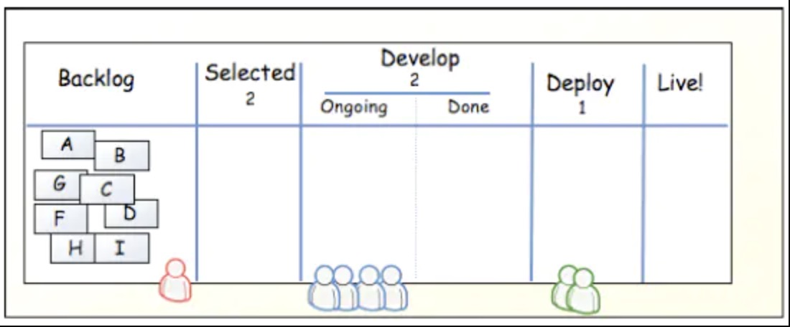
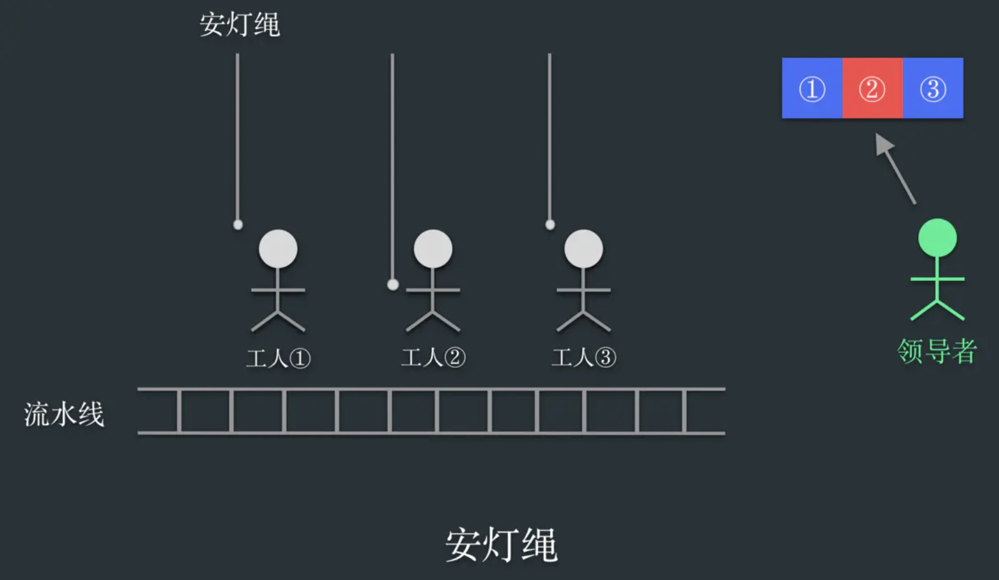

# content
- [content](#content)
  - [1. 简述](#1-简述)
  - [2 流动原则](#2-流动原则)
    - [2.1 可视化](#21-可视化)
    - [2.2 在制品限制](#22-在制品限制)
    - [2.3 任务拆分](#23-任务拆分)
    - [2.4 减少交接](#24-减少交接)
    - [2.5 约束点](#25-约束点)
    - [2.5 消除浪费](#25-消除浪费)
  - [3. 反馈机制](#3-反馈机制)
    - [3.1 在源头控制](#31-在源头控制)
  - [3.持续学习与实验原则](#3持续学习与实验原则)
    - [3.1 免责](#31-免责)
    - [3.2 改进与学习](#32-改进与学习)
    - [3.3 注入故障和弹性](#33-注入故障和弹性)

## 1. 简述

三步工作法的第一步就是实现**流动**，即实现从开发到运维的工作，快速地从左向右流动。

第二步就是**反馈**，从左到右的过程中，每一步都有快速的反馈，避免问题的复发，能及时发现和修复问题。

第三部是**持续学习**，目的是要创建有创新精神和信任度搞的企业文化，支持动态、严格且科学的实验，从失败中不断学习。

## 2 流动原则

在价值的交付过程中，往往是从开发流向运维，模糊的需求流向有价值的产品，所以工作的第一步就是要建立从开发到运维之间快速、平滑且能向用户交付价值的工作流。

当我们熟悉并了解了整个价值流之后，我们就能清晰的知道整个价值流体系中，瓶颈在哪里，从而可以从全局优化整个流动，而不是陷入局部优化。在局部优化中，我们往往关注功能的完成度、Bug的发现率和修复率、运维维护的可用性等指标。

在这一部分工作内容中，要主要关注几个核心点即可视化、任务拆分、在制品限制、减少人为交接次数、识别和改进约束点，消除浪费。

### 2.1 可视化

和制造业生产流程不一样，IT技术行业的工作内容一般是不可见的。比如开发人员说“忙不过来”的时候，到底有多少功能等待他开发才让他忙不过来？测试人员抱怨自己”测不过来“时，到底有多少功能需要测试的时候测试人员才会测不过来？这些都是不可见的。不可见就会造成整个开发过程中哪个环节受阻？哪个环节投入资源过剩？这些问题都不知道。

为了识别工作队列的流动、排队或者停止的情况，就要把工作可视化。可视化的方式有很多形式，比如看板或者Sprint计划版，甚至是物理的黑板表格等等。

看板能清晰地将工作可视化，从任务的创建时间到完成时间，可以推算出工作[前置时间](devops/data.md)，通过提升管理任务的效率，加速任务从左到右的流动速度。通过可视化，项目经理和产品经理能列出各项工作的优先级，每次迭代就可以从优先级高的任务开始。

看板形式如下:
    

### 2.2 在制品限制

在制造业的日常工作，通常是由定期生成的生产计划决定的。计划会根据客户订单、交货日期、零件库存等条件，确定执行哪些任务。但是IT技术工作过程中会发现紧急、临时安插的任务数量，可能比计划进行任务数量还要多，这种临时的任务往往会打断工程师的思路，造成工程师在不同任务之间切换，而这种中断造成的代价往往是不可见的。

比如有个工程师为了开发一个计划中的功能，需要重构一段遗留代码，这段代码读了一半，还没理清逻辑。这时测试人员说有需要紧急修复的 Bug ，工程师就需要停止读代码，为了调试和修复这个 Bug ，开始读另一段代码。如果这时候产品经理又跑过来，说要加需求，然后开始描述，这时候该工程师又要切换思路，想一下这个需求能不能实现，实现要多久。在这时，工程师手上有 3 个任务，3 个任务都没有完成，假如最初工程师读遗留代码的时间花了 10 分钟，再读 5 分钟，就知道怎么改了。也就是在等 5 分钟，就有一项任务能被完成了，前置时间就变少了，而临时安插的 Bug 修复任务和新增的需求，则让前置时间变长了。这时候回过头来，可能又要花多 15 分钟，也就是原本 15 分钟能完成的任务，现在需要 30 分钟，工作效率大大降低。

在制品限制是影响前置时间的关键因素。如上看板，一般在制品限制的做法是在标题中添加在制品数量，比如"Selected (2)"。在开发时在制品往往来自带实现的需求或者待修复的缺陷。当某个工作队列的工作数量达到上限时，就要进制添加新卡片。通过限制在制品数量，还能发现开发流程中存在的阻碍，比如有的团队会发现测试团队经常没事干，因为要等待开发人员开发完成。又或者发现开发团队没事干，因为要等待产品经理把需求分析完成。当我们查明并且解决导致等待的原因后，我们就能够减少任务前置时间。

### 2.3 任务拆分

建立快速的工作流的关键是通过小批量的模式完成工作。所以我们必须合理的拆分当前工作，避免出现大批量任务，因为大批量任务更容易造成拥堵，修改调整也相当困难，从而会增加前置时间，影响交付质量。

个关于著名高尔夫球手“老虎”伍兹的故事。高尔夫球手在打球的时候，可能会受到一些外界干扰。一般情况下还好，如果他已经开始挥杆，这时候受到了干扰，一般选手肯定是继续把杆挥下去，但通常的结果是打得不理想。而伍兹遇到这种情况，他会停下来，重新做挥杆的动作，保证了每一杆动作的标准。伍兹能停下来，固然是经过了大量的练习，但还有一个关键在于，对于别人而言，挥杆击球是一个动作，必须一气呵成。而对伍兹来说，这个动作是由若干小动作组成的，他只不过是刚好完成了某个小动作，而没有做下一个小动作而已。换句话说，大家同样都是完成一个原子操作，只不过，伍兹的原子操作比其他人的原子操作小得多。这个故事其实说的是任务分解。

敏捷开发中的迭代追求的是可及时调整中间过程，在需求变化的时候还能掌握变化，从而可以在短周期内经常性交付有价值的软件。在技术价值流中，单件流可以通过持续部署实现，每一个提交到版本控制系统的变更，都会进行集成、测试并部署到生产环境。

### 2.4 减少交接

代码在技术价值流流转的过程中，需要各个部门的协同才能完成，包括功能测试、集成测试、环境搭建、配置服务器、存储管理、网络、负载均衡设备和信息安全加固等工作。一项工作在团队之间交接时，需要大量的沟通、请求、委派、通知、协调，而且需要安排优先级、调度、消除冲突、测试和验证。

而且，在交接过程中往往会丢失某些关键信息，甚至造成重复的工作。比如开发人员让运维人员创建一个新的DB用来测试，运维人员可能在忙其他的，过了一会才帮忙创建一个DB，但是运维人员不知道这个DB是用来干什么的，也可能通过有效沟通不需要创建。为了减少类似问题，可以减少人为的交接工作，比如使用自动化操作，让开发人员自服务的平台等。

我们要减少工作在队列中的等待时间，减少非增值工作的时间，以增加工作的流动性。

### 2.5 约束点

为了缩短前置时间、提高生产系统的吞吐量，我们要不断识别系统中的约束点，才能提高产能。《目标》一书中提到：在任何价值流中，总有一个流动方向、一个约束点（瓶颈），任何不针对该约束点做的优化都是徒劳的。

比如当测试部门的工作过量时，再对开发效率进行优化时，就会有更多的功能需要测试，导致优化的结果让总的产出效率下降了。

约束点的优化，应该遵循以下流程

**识别瓶颈 -> 找出措施 -> 协力解决 -> 突破瓶颈 -> 重复执行**

在DevOps的转型过程中，我们常常遇见以下约束点
- 环境的搭建

我们部署一套基础设施等待应用的部署需要多长时间？在过去如果是物理机，从采购、上架、配电、安装操作系统、配置网络等怎么也得1个多月以上。后来使用了虚拟机就大大缩短这一过程。现在最新的是使用容器，进一步缩短了时间，如果有一套k8s平台，那么环境的准备基本上可以忽略不计。

所以保证团队成员能通过自动化的方式创建环境，是解决`环境搭建`这个约束点的关键

- 代码部署

如果代码部署需要很长时间，比如每次部署都有很多手动操作，并涉及很多人员，那就无法实现按需部署。

对于实施运维人员最可气的就是一份几百页的部署文档！

解决这个约束点的关键是尽量自动化代码部署的过程，让每个开发人员，都可以按需自动化部署代码。比如使用持续集成工具Jenkins等

- 测试
如果每次代码部署，都要两个星期的时间完成测试环境的准备和数据集的配置，手动执行所有回归测试也要 4 个星期的时间，那就无法实现按需部署。
解决办法是实现自动化测试，以便在安全、并行地执行部署的同时，让测试的速度跟上开发的速度。或者使用A\B测试、灰度发布等

如果能突破上面 3 个约束点，那接下来可能遇到约束点就会是开发部门或产品部门

### 2.5 消除浪费

丰田生产系统的先驱之一新乡重夫认为，浪费是企业增长的最大威胁，精益中对浪费的常用定义是：使用超出客户需求和客户愿意支付的范围内的任何材料或资源的行为。

新乡重夫定义了制造业中 7 种主要的浪费类型：库存、过量生产、过度加工、运输、等待、移动和缺陷。

浪费一次似乎有主动的含义，但是并不一定是工程师主动造成浪费。这是一种困境。

为了消除浪费往往通过以下类型
- 半成品，项目中不应该存在长期的半成品，因为随着时间的推移，半成品必将失去价值
- 额外的工序，在交付过程中未带来价值的工作，比如下游工作中从来没有使用过的文档，不使用的输出结果
- 额外的功能,额外功能增加了功能测试、管理复杂度和工作量，额外功能包括在交付过程中构建的，组织或客户不需要的功能。比如花时间搞炫酷的功能
- 任务切换，一个人在多个任务和价值流中，必然会有任务的切换，切换会导致耗费额外的工作量和时间
- 等待,由于资源竞争，在工作是产生等待，减慢了流动速度
- 会议，不必要的会议会造成很大的浪费，因为人多的会议往往很难形成结论。
- 手动操作, 我们应该尽量避免手动的非标准的操作，理想的情况下，任何依赖运维团队手动完成的操作，都应该配置为能自动化且按需提供的，也就是自助服务。

## 3. 反馈机制

Andon系统（也称“安灯”、“暗灯”，原为日语的音译，日语的意思为“灯光”、“灯笼”），最早起源于日本丰田汽车公司，用来实现“立即暂停制度”，以即时解决质量问题（而不是下线返修），达到持续高品质地生产汽车。

Andon工作流程主要包含：
1. 当操作者需要帮助、发现质量等与产品制造、质量有关的问题，他就拉下吊绳或用遥控器，激活Andon系统，该信息通过操作工位信号灯、Andon看板、广播将信息发布出去，提醒所有人注意。
2. 班组长响应质量要求，与操作工一同确定问题。如果班组长可以解决问题，重新拉下吊绳，系统恢复正常。如果确定的问题必须向其它部门求助解决，则班组长通过设置在区域集中呼叫台进行呼叫，将信息类型、呼叫内容再次通过Andon看板、广播将信息发布出去，呼叫物料、质量、油漆、维修等前去处理问题。
3. 如果在规定时间无法解决问题，则会停掉整个生产线，让所有人一起合作，直到解决问题为止。

立即解决问题有以下好处
- 减少修复成本，防止把问题带到下游，否则修复成本会加剧
- 避免引入错误，避免一个问题引发其他问题
- 避免重复损失，立刻解决问题防止同一个问题再次引发故障

Cynefin框架描述了组织所处的环境。组织所处环境有五种类型，分别是简单、繁杂、复杂、混沌、失序。

简单是指，因果关系清晰可见的，决策往往为决策者可以采用的策略是：感知（sense）–分类（categorize）–响应（respond）。繁杂是因果关系明确，但需要专家研究和解决，决策策略为：感知（sense）–分析（analyze）–响应（respond）。复杂是指，因果关系可以被回溯，但不可能提前预知，解决方案慢慢浮出来，而不是一次性就明确的，所以需要不断摸索、不管试错，不断迭代,策略为:探索（probe）–感知（sense）–响应（respond）。混沌是因果关系不清晰，信息复杂多变，这个时候往往采取的策略为：行动（act）–感知（sense）–响应（respond）。失序就是黑洞，不清楚是不是出了问题，也不清楚问题属于哪个常见，各种冲突不断。

> 反者道之动，当我们处于任何一种环境中都不知道骄傲，也不应该沮丧，因为随着知识的积累，我们可以从混乱到复杂再到繁杂再到简单顺时针移动；同样，偏见的积累、自满也会导致灾难的发生，产生简单到繁杂到复杂的逆时针移动。

在IT工作过程中，我们大部分时候处在复杂这一状态中，所以我们的策略应为：密集立刻解决问题，而不是绕开问题，密集解决问题来促进学习。这种全民动员的做法与常规的管理方法不同，因为局部问题扰乱了整体的运营，但是这种方式让大家都能从问题中学习到知识。立刻解决问题，能防止记忆模糊和情况变化导致的关键信息丢失，关键信息对于修复复杂系统中的问题很重要。在复杂系统中，人员、流程、产品、地点和情况都存在很多意料之外、特殊的相互作用，随着时间的推移，往往很难再重现问题发生时的场景。

要想在技术价值流中建立快速反馈的机制，我们就要建立类似于安灯绳和全员响应的机制。

我们要树立一种文化，鼓励大家在发生问题时拉动安灯绳，无论是生产事故还是价值流的早期出现错误，这个行为是安全的。

比如当有人提交代码导致持续构建或测试失败，触发安灯绳时，我们就可以聚集在一起解决问题，停止开展任何新的工作，直到问题解决了为止。使用Andon绳机制，能让我们快速定位问题，避免出现更复杂的情况，导致问题因果关系变的模糊。

那么在实际工作中我们该如何做呢？

### 3.1 在源头控制

对意外和事故的临时处理模式，我们可能在无意之中将本不安全的系统固化下来。在复杂的系统中，通过加入更多的审批流程，不断不会降低故障率，甚至会导致故障率的上升。因为在作出决策的地方往往原理执行工作的地方，导致审批流程的有效性下降。建立更多审批流程，不仅降低了决策质量，还增加了决策周期，削弱了因果关系之间的反馈强度，降低了工作人员在成功和失败中学习的能力。即使在一些较小的简单系统中，也存在这种情况，一般是因为清晰度和及时性不足，自上而下的官僚主义和控制系统变得无效，导致应该做事的人和实际做事的人存在巨大差异。

我们如何做到在源头控制质量

- 避免不必要的等待
问题应该被立刻解决而不是等其流转到下游团队，比如测试团队、运维团队等

- 自动化

需要其他团队帮忙完成一系列乏味、易出错和需要手动执行的任务，这些任务本该由需求方采用自动化的方式完成。比如测试人员需要开发人员才能打包，而不是通过 Jenkins 自己调整配置，自动打包。

- 现场执行工作

现场权限放开，不需要在远距离的领导做决策，因为在工作繁忙的领导批准时，往往出现领导在不了解工作情况和潜在影响的情况下，作出低质量的决策，又或者只是例行公事地盖章。

- 避免无效的文档

往往文档的歧义很大，更新也不及时，很可能在刚写完不久就已经过时，在必要的时候应该引入BDD（行为驱动开发)

在源头保证质量，意味着不论是质量控制还是安全责任，决策都要由执行工作的人作出，而不是依赖于高层领导的审批。根据同行评审评定变更，确保变更将按照设计运行，以自动化的方式进行质量和安全性检查。

## 3.持续学习与实验原则

三步工作法中的第三部，就是一个螺旋上升的过程，当然这个过程得有组织文化的承托

### 3.1 免责

我们工作在复杂系统中，不可避免会经常出错。出现错误时，很多公司处理的方法是：Name , Blame , Shame。出现错误时是一种责备和追责为主的文化。这样会导致组织内形成一种恐惧感，如果团队成员都很恐惧，怕做错事受到责备，就会选择把小的问题隐藏掉，直到问题积累到一定程度最终灾难性的爆发。

Westrum模型提出组织文化的三种类型，分别是病态型组织、官僚型组织和生机型组织。

**病态型组织**的特点是大量的恐惧和威胁，倾向于隐藏失败；

**官僚型组织**的特点是严格的规则和流程，每个部门各扫门前雪；

**生机型组织**是积极寻找和共享信息，责任共享，失败引发反思。

在DevOps的范畴里应该构建生机型的文化，引导一个免责的故障事后分析机制，让学习过程变成良性的循环。

2017年1月31号晚上GitLab发生了非常重大的事故，某个运维人员在凌晨删除了数据库，大概有6小时的数据丢失，包括合并请求、评论等，而且是永久性丢失。有707位用户、5037个项目受影响。

官方视频直播了恢复过程，他们主要做的是问题根因分析，采用了5W（五个为什么）的方法，分析问题并制定改进措施。但是官方也表态，造成问题的运维人员不会被解雇，而是被迫看一个很无聊的视频作为处罚。

这个例子反映出DevOps提倡的是免责的文化，重点并不在追责，而是转移到根因分析和对于恢复过程的改进，这是生机型组织的明显特征。

### 3.2 改进与学习

Linkedin 2003年成立，当时核心业务运行在叫做Leo的Java单体应用上，多年发展后，2010年Leo外围有100个系统，问题是核心的Leo系统经常宕机，难以发布新代码。于是Linkedin做出一个决定，通过两个月时间，完全不做新的功能开发，完全聚焦在非功能需求上，将之前积累近十年的技术债务一次性偿还，相信这是一个非常艰难的决定。这个案例给我们的启示，比日常工作更重要的，是改进日常工作，我们要把改进融入到日常的工作中。

如果团队没有能力或意愿改进现有的工作流程，就会持续遭受眼前问题的折磨，而且问题带来的麻烦往往会与日俱增。

Mike Rother 在《丰田套路》一书中指出，就算我们不去优化工作的现状，流程也不会一成不变，混乱和无序的流程，会随着时间的推移持续恶化。在技术价值流中，为了防止灾难性事故的发生，团队陷于实施各种临时解决方案的工作中，没有时间完成有价值的工作。用临时方案解决问题的模式，往往会导致问题和技术债务的积累。在每个开发周期的间歇中预留一段时间，或让工程师通过自组团队的方式，解决他们感兴趣的问题。明确预留实践改善日常工作，包括偿还技术债、修复缺陷、重构、优化代码和环境等。

一旦改善在某个环节取得成功，就应该把他分享给全局，让更多的人从中收益，当然这种知识不能局限在文档层面，而是应该转化为显性知识，比如将其应用于实践，改善其他环节的工作等。

此外不同组织应该频繁分享和交流优化的方法，共同学习有效的改进。

### 3.3 注入故障和弹性

丰田的一个顶级供货商有两条生产线，但是在Slow Day的时候会把所有的制造放在一条生产线上，用来实验增大压力、扩充容量是否会导致失败，增强反脆弱的能力。

同样在技术价值流中，也有成为Game Day的演习，模拟大规模失败，检查系统稳定性。Netflix的Chaos Monkey工具，会在生产环境随机杀进程，用来确保整个系统有强大的恢复能力。Martin Fowler提出“If it hurts，do it more often”。即如果某个事情让你感到痛苦，那么频繁去做，那么你将不会感觉到痛苦。

在技术团队中，我们要不断给技术团队施压，来试探出瓶颈，然后优化瓶颈。持续不断的实验，即使当前比较稳定，我们也要在极限的边缘和故障的边缘游走，从而能提高团队的韧性，使真正出现故障或者灾难时，我们能像日常工作那样处理。

