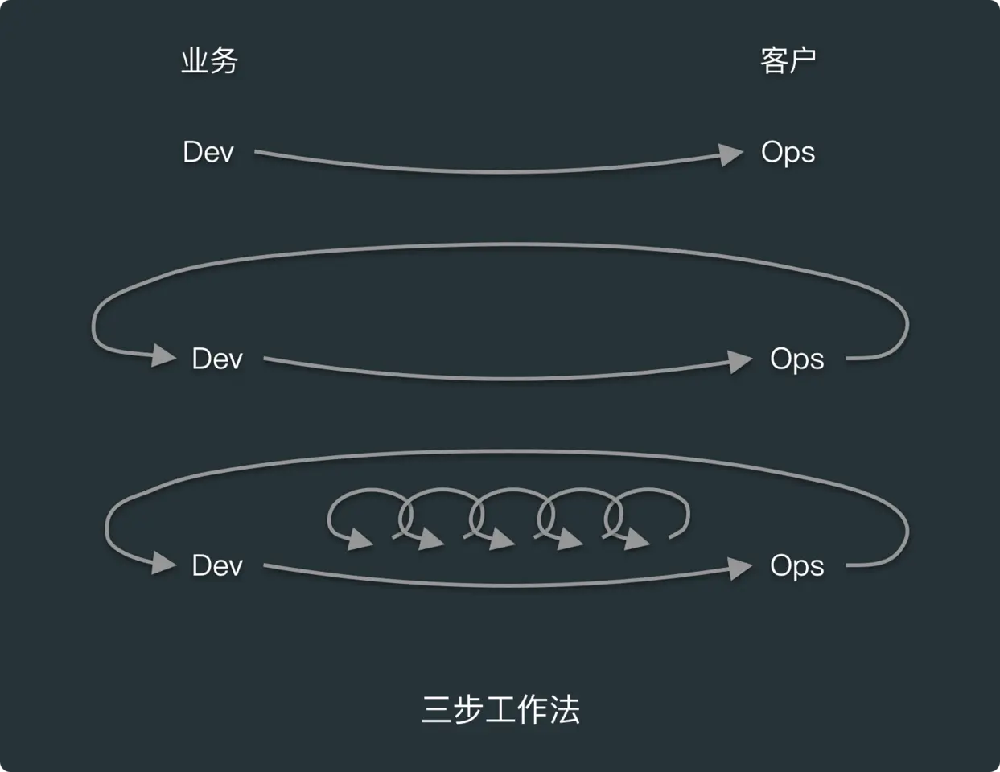
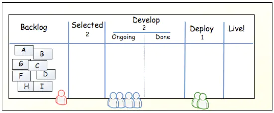

# content- [content](#content)
  - [1. 简述](#1-简述)
  - [2.1 流动原则](#21-流动原则)
    - [2.1.1 可视化](#211-可视化)
    - [2.1.2 在制品限制](#212-在制品限制)
    - [2.1.3 任务拆分](#213-任务拆分)
    - [2.1.4 减少交接](#214-减少交接)
    - [2.1.5 约束点](#215-约束点)
    - [2.1.5 消除浪费](#215-消除浪费)

## 1. 简述

三步工作法的第一步就是实现**流动**，即实现从开发到运维的工作，快速地从左向右流动。

第二步就是**反馈**，从左到右的过程中，每一步都有快速的反馈，避免问题的复发，能及时发现和修复问题。

第三部是**持续创新**，目的是要创建有创新精神和信任度搞的企业文化，支持动态、严格且科学的实验，从失败中不断学习。

## 2.1 流动原则

在价值的交付过程中，往往是从开发流向运维，模糊的需求流向有价值的产品，所以工作的第一步就是要建立从开发到运维之间快速、平滑且能向用户交付价值的工作流。

当我们熟悉并了解了整个价值流之后，我们就能清晰的知道整个价值流体系中，瓶颈在哪里，从而可以从全局优化整个流动，而不是陷入局部优化。在局部优化中，我们往往关注功能的完成度、Bug的发现率和修复率、运维维护的可用性等指标。

在这一部分工作内容中，要主要关注几个核心点即可视化、任务拆分、在制品限制、减少人为交接次数、识别和改进约束点，消除浪费。

### 2.1.1 可视化

和制造业生产流程不一样，IT技术行业的工作内容一般是不可见的。比如开发人员说“忙不过来”的时候，到底有多少功能等待他开发才让他忙不过来？测试人员抱怨自己”测不过来“时，到底有多少功能需要测试的时候测试人员才会测不过来？这些都是不可见的。不可见就会造成整个开发过程中哪个环节受阻？哪个环节投入资源过剩？这些问题都不知道。

为了识别工作队列的流动、排队或者停止的情况，就要把工作可视化。可视化的方式有很多形式，比如看板或者Sprint计划版，甚至是物理的黑板表格等等。

看板能清晰地将工作可视化，从任务的创建时间到完成时间，可以推算出工作[前置时间](devops/data.md)，通过提升管理任务的效率，加速任务从左到右的流动速度。通过可视化，项目经理和产品经理能列出各项工作的优先级，每次迭代就可以从优先级高的任务开始。

看板形式如下:
    

### 2.1.2 在制品限制

在制造业的日常工作，通常是由定期生成的生产计划决定的。计划会根据客户订单、交货日期、零件库存等条件，确定执行哪些任务。但是IT技术工作过程中会发现紧急、临时安插的任务数量，可能比计划进行任务数量还要多，这种临时的任务往往会打断工程师的思路，造成工程师在不同任务之间切换，而这种中断造成的代价往往是不可见的。

比如有个工程师为了开发一个计划中的功能，需要重构一段遗留代码，这段代码读了一半，还没理清逻辑。这时测试人员说有需要紧急修复的 Bug ，工程师就需要停止读代码，为了调试和修复这个 Bug ，开始读另一段代码。如果这时候产品经理又跑过来，说要加需求，然后开始描述，这时候该工程师又要切换思路，想一下这个需求能不能实现，实现要多久。在这时，工程师手上有 3 个任务，3 个任务都没有完成，假如最初工程师读遗留代码的时间花了 10 分钟，再读 5 分钟，就知道怎么改了。也就是在等 5 分钟，就有一项任务能被完成了，前置时间就变少了，而临时安插的 Bug 修复任务和新增的需求，则让前置时间变长了。这时候回过头来，可能又要花多 15 分钟，也就是原本 15 分钟能完成的任务，现在需要 30 分钟，工作效率大大降低。

在制品限制是影响前置时间的关键因素。如上看板，一般在制品限制的做法是在标题中添加在制品数量，比如"Selected (2)"。在开发时在制品往往来自带实现的需求或者待修复的缺陷。当某个工作队列的工作数量达到上限时，就要进制添加新卡片。通过限制在制品数量，还能发现开发流程中存在的阻碍，比如有的团队会发现测试团队经常没事干，因为要等待开发人员开发完成。又或者发现开发团队没事干，因为要等待产品经理把需求分析完成。当我们查明并且解决导致等待的原因后，我们就能够减少任务前置时间。

### 2.1.3 任务拆分

建立快速的工作流的关键是通过小批量的模式完成工作。所以我们必须合理的拆分当前工作，避免出现大批量任务，因为大批量任务更容易造成拥堵，修改调整也相当困难，从而会增加前置时间，影响交付质量。

个关于著名高尔夫球手“老虎”伍兹的故事。高尔夫球手在打球的时候，可能会受到一些外界干扰。一般情况下还好，如果他已经开始挥杆，这时候受到了干扰，一般选手肯定是继续把杆挥下去，但通常的结果是打得不理想。而伍兹遇到这种情况，他会停下来，重新做挥杆的动作，保证了每一杆动作的标准。伍兹能停下来，固然是经过了大量的练习，但还有一个关键在于，对于别人而言，挥杆击球是一个动作，必须一气呵成。而对伍兹来说，这个动作是由若干小动作组成的，他只不过是刚好完成了某个小动作，而没有做下一个小动作而已。换句话说，大家同样都是完成一个原子操作，只不过，伍兹的原子操作比其他人的原子操作小得多。这个故事其实说的是任务分解。

敏捷开发中的迭代追求的是可及时调整中间过程，在需求变化的时候还能掌握变化，从而可以在短周期内经常性交付有价值的软件。在技术价值流中，单件流可以通过持续部署实现，每一个提交到版本控制系统的变更，都会进行集成、测试并部署到生产环境。

### 2.1.4 减少交接

代码在技术价值流流转的过程中，需要各个部门的协同才能完成，包括功能测试、集成测试、环境搭建、配置服务器、存储管理、网络、负载均衡设备和信息安全加固等工作。一项工作在团队之间交接时，需要大量的沟通、请求、委派、通知、协调，而且需要安排优先级、调度、消除冲突、测试和验证。

而且，在交接过程中往往会丢失某些关键信息，甚至造成重复的工作。比如开发人员让运维人员创建一个新的DB用来测试，运维人员可能在忙其他的，过了一会才帮忙创建一个DB，但是运维人员不知道这个DB是用来干什么的，也可能通过有效沟通不需要创建。为了减少类似问题，可以减少人为的交接工作，比如使用自动化操作，让开发人员自服务的平台等。

我们要减少工作在队列中的等待时间，减少非增值工作的时间，以增加工作的流动性。

### 2.1.5 约束点

为了缩短前置时间、提高生产系统的吞吐量，我们要不断识别系统中的约束点，才能提高产能。《目标》一书中提到：在任何价值流中，总有一个流动方向、一个约束点（瓶颈），任何不针对该约束点做的优化都是徒劳的。

比如当测试部门的工作过量时，再对开发效率进行优化时，就会有更多的功能需要测试，导致优化的结果让总的产出效率下降了。

约束点的优化，应该遵循以下流程

**识别瓶颈 -> 找出措施 -> 协力解决 -> 突破瓶颈 -> 重复执行**

在DevOps的转型过程中，我们常常遇见以下约束点
- 环境的搭建

我们部署一套基础设施等待应用的部署需要多长时间？在过去如果是物理机，从采购、上架、配电、安装操作系统、配置网络等怎么也得1个多月以上。后来使用了虚拟机就大大缩短这一过程。现在最新的是使用容器，进一步缩短了时间，如果有一套k8s平台，那么环境的准备基本上可以忽略不计。

所以保证团队成员能通过自动化的方式创建环境，是解决`环境搭建`这个约束点的关键

- 代码部署

如果代码部署需要很长时间，比如每次部署都有很多手动操作，并涉及很多人员，那就无法实现按需部署。

对于实施运维人员最可气的就是一份几百页的部署文档！

解决这个约束点的关键是尽量自动化代码部署的过程，让每个开发人员，都可以按需自动化部署代码。比如使用持续集成工具Jenkins等

- 测试
如果每次代码部署，都要两个星期的时间完成测试环境的准备和数据集的配置，手动执行所有回归测试也要 4 个星期的时间，那就无法实现按需部署。
解决办法是实现自动化测试，以便在安全、并行地执行部署的同时，让测试的速度跟上开发的速度。或者使用A\B测试、灰度发布等

如果能突破上面 3 个约束点，那接下来可能遇到约束点就会是开发部门或产品部门

### 2.1.5 消除浪费

丰田生产系统的先驱之一新乡重夫认为，浪费是企业增长的最大威胁，精益中对浪费的常用定义是：使用超出客户需求和客户愿意支付的范围内的任何材料或资源的行为。

新乡重夫定义了制造业中 7 种主要的浪费类型：库存、过量生产、过度加工、运输、等待、移动和缺陷。

浪费一次似乎有主动的含义，但是并不一定是工程师主动造成浪费。这是一种困境。

为了消除浪费往往通过以下类型
- 半成品，项目中不应该存在长期的半成品，因为随着时间的推移，半成品必将失去价值
- 额外的工序，在交付过程中未带来价值的工作，比如下游工作中从来没有使用过的文档，不使用的输出结果
- 额外的功能,额外功能增加了功能测试、管理复杂度和工作量，额外功能包括在交付过程中构建的，组织或客户不需要的功能。比如花时间搞炫酷的功能
- 任务切换，一个人在多个任务和价值流中，必然会有任务的切换，切换会导致耗费额外的工作量和时间
- 等待,由于资源竞争，在工作是产生等待，减慢了流动速度
- 会议，不必要的会议会造成很大的浪费，因为人多的会议往往很难形成结论。
- 手动操作, 我们应该尽量避免手动的非标准的操作，理想的情况下，任何依赖运维团队手动完成的操作，都应该配置为能自动化且按需提供的，也就是自助服务。
