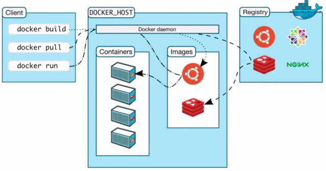

# content
- [content](#content)
  - [1. docker 架构](#1-docker-架构)
  - [2. Docker 核心原理](#2-docker-核心原理)
    - [2.1 namespace 资源隔离](#21-namespace-资源隔离)
      - [2.1.1 UTS](#211-uts)
      - [2.2.2 IPC](#222-ipc)
      - [2.2.3 PID](#223-pid)
      - [2.3.4 MNT](#234-mnt)
      - [2.3.5 NET](#235-net)
      - [2.3.6 User](#236-user)
  - [2.2 cgroups 资源限制](#22-cgroups-资源限制)

## 1. docker 架构


如上图所示，Docker 是一个客户端-服务器（C/S）架构程序。Docker 客户端只需要向 Docker 服务器或者守护进程发出请求，服务器或者守护进程将完成所有工作并返回结果。我们日常使用的docker命令，其实就是docker客户端程序。
从图中可以看出，docker主要包含三个部分
- **docker 服务端**: 所有核心工作均在服务端完成，包括镜像处理，网络处理，存储处理，运行时工作等等。
- **docker 客户端**: docker就是个客户端，不仅可以链接本地docker daemon也可以链接其他主机的docker daemon。
- **镜像仓库** : docker damon在启动容器时会优先看本地是否包含镜像，若没有则需要去镜像仓库拉去，默认的镜像仓库为docker hub.也可以设置私有镜像仓库.

## 2. Docker 核心原理
Docker容器本质上是宿主机上的进程。Docker通过namespace实现了资源隔离，通过cgroups实现了资源限制，通过写时复制机制实现文件操作。

### 2.1 namespace 资源隔离
如果在Docker出现之前，被问起如何实现操作系统上的隔离，那么第一个会想到的是`chroot`。`chroot`可以直接修改根挂载点，让我们感觉到可以将资源限制在一个区域。但是这不是真的隔离，我们还想进一步隔离。比如网络隔离，就必须有独立的IP、端口、路由等；同时我们还想有自己的主机名；进程间通信也需要隔离，防止高权限攻击低权限进程；我们还有用户权限的隔离的问题；此外不同隔离之间的PID也应该都有自己的。
Linux内核提供了6种namespace隔离的系统调用。
|namespace|系统调用参数|隔离内容|
|--|---|---|
|UTS|CLONE_NEWUTS|主机名与域名|
|IPC|CLONE_NEWIPC|信号量、消息队列和共享内存|
|PID|CLONE_NEWPID|进程编号|
|Network|CLONE_NEWNET|网络设备、网络栈、端口|
|Mount|CLONE_NEWNS|挂载点（文件系统）|
|User|CLONE_NEWUSER|用户和用户组|

Linux内核实现namespace的主要目的，就是实现轻量级虚拟化服务。在同一个namespace下的进程可以感知彼此的变化，而对外界的进程一无所知。这样就可以让namespace里面的进程产生错觉，仿佛自己置身与一个独立的系统环境中，从而达到隔离的目的。

#### 2.1.1 UTS
UTS(UNIX Time-sharing System) namespace 提供了主机名和域名的隔离，这样每个Docker容器就可以拥有独立的主机名和域名了，在网络上可以被视为独立的节点，而非宿主机上的一个进程。使用docker创建出的容器，默认主机名为`container id`，也可以使用--hostname 参数指定主机名
```bash
[root@3-1-20-1-whq ch]# docker run -d -ti --hostname=myhost --name=demo ubuntu top
34e6219cec56ae3627e0258db7a9027223eda3232de9a54ecbe511226eede652
[root@3-1-20-1-whq ch]# 
[root@3-1-20-1-whq ch]# docker exec -ti demo hostname
myhost
```
#### 2.2.2 IPC
IPC(Inter-Process Communication) namespace,涉及IPC资源包括常见的信号量、消息队列和共享内存。申请了IPC资源就申请了一个全局唯一的32位ID，所以IPC namespace实际上包含了系统IPC标识符以及实现POSIX消息队列的文件系统。在同一个IPC namespace下的进程彼此可见，不同IPC namespace下进程互相不可见。Docker使用IPC namespace实现了容器与宿主机、容器与容器之间IPC隔离。
```bash
# 和宿主机使用同一个namespace
docker run -d --ipc=host data-client
# 可以使不同的容器使用同一个IPC namespace
docker run -d --ipc=container:data-server data-client
```
#### 2.2.3 PID
PID namespace, 对进程PID重新标号，即两个不同namespace下的进程可以有相同的PID。每个PID namespace 都有自己的计数程序。内核为所有的PID namespace维护了一个树状结构，最顶层被称为root namespace。root namespace创建子namespace,子namespace再创建子namespace,以此内推。父namespace可以看到子namespace下的PID,子namespace无法看到父namespace下的PID。

于是我们可以发现：1.每个namespace中的第一个进程PID为1；2.不同namespace之间的pid号互不相关，即使父namespace看到子namespace下的PID号也和子namespace看到的不同；3.root namespace可以看到所有的进程，并且递归包含所有子节点中的进程。

在PID namespace中需要注意的是PID=1的init进程，init的地位非常特殊，它做为所有进程的父进程，维护这一张进程表，不断检查进程状态，一旦发现有某些进程因为父进程的原因变成孤儿进程，它就会负责收养该进程，并完成资源回收等操作。所以当使用Docker时，当容器中包含多个进程时，一定要考虑PID=1进程是否具有进程收养的功能，否则容易出现僵尸进程

> 可以参考容器化改造的建议：[容器化改造](containergo.md)

#### 2.3.4 MNT
mount namespace 是Linux中第一个引入的Linux namespace,它通过隔离文件系统挂载点对隔离文件系统提供支持。不同mount namespace中的文件结构发生改变也相互不影响。可以通过/proc/[pid]/mounts查看到所有挂载在当前namespace中的文件系统。进程在创建mount namespace时，会把当前的文件结构复制给新的namespace。新的namespace中的所有mount操作都只影响自身的文件系统，对外界不产生任何影响。这种方法是严格的，但是有些情况却不实用，比如父节点中挂载了一个CD-ROM，子节点的namespace是无法做出复制，因为会影响父节点的文件系统。2006年引入的挂载传播解决了这个问题,其定义了挂载对象的传播关系，一种挂载状态可以是以下一种
- 共享挂载
- 从属挂载
- 共享/从属挂载
- 私有挂载
- 不可绑定挂载

#### 2.3.5 NET
network namespace主要提供关于网络资源的隔离，包括网络设备、IPv4和IPv6协议栈、IP路由表、防火墙、/proc/net目录、/sys/class/net目录、套接字等。一个物理的网络设备一般存在于一个namespace中，不同网络设备通过veth pair在不同namespace之间通信。
> veth pair可以理解成管道，更形象点可以理解成网线。

一般情况，物理网络设备都分配在root namespace中，当有多个网卡时，可以将其分配给新的network namespace。从这里看网络并没有真正实现隔离，而是把网络独立出来给外界一个透明的感觉。容器中常见的做法是，每创建一个container就创建一个veth pair，一端放到新的namespace中，另一段放在默认的root namespace中链接到物理网络设备，再通过多个设备接入网桥或者路由转发的方式实现通信。
> 再建立veth pair之前，两个namespace之间通信是通过管道完成的。

#### 2.3.6 User
user namespace主要隔离了安全相关的标识符和属性，包括用户ID、用户组ID。简单来说，就是普通用户可以通过系统调用，在新创建的user namespace中可以拥有不同的用户和用户组。
> user namespace是6个namespace隔离技术中最新的，即使到了内核3.8版本还有部分文件系统不支持。所有在变异内核的时候并未开启`USER_NS`属性。

- user namespace被创建后，第一个进程被赋予该namespace中的全部权限，这样init进程就可以完成必要的初始化工作。
- user namespace中创建的用户并未和父namespace中用户关联，默认显示UID为65534

## 2.2 cgroups 资源限制