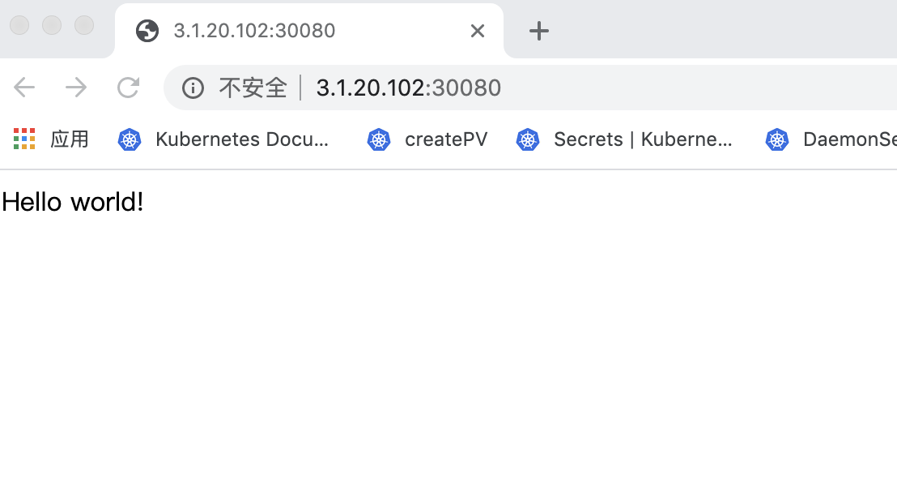

# content

- [content](#content)
  - [1. ubuntu](#1-ubuntu)
    - [1.1 系统要求](#11-系统要求)
    - [1.2 卸载旧版本](#12-卸载旧版本)
    - [1.3 存储驱动](#13-存储驱动)
    - [1.4 安装](#14-安装)
      - [1.4. apt-get 安装](#14-apt-get-安装)
      - [1.4.2 脚本安装](#142-脚本安装)
    - [1.5 启动 Docker CE](#15-启动-docker-ce)
    - [1.6 建立docker用户组](#16-建立docker用户组)
    - [1.7 测试Docker是否正确安装](#17-测试docker是否正确安装)
    - [1.8 镜像加速](#18-镜像加速)
  - [2. Centos/RedHat](#2-centosredhat)
    - [2.1 系统要求](#21-系统要求)
    - [2.2 卸载旧版本](#22-卸载旧版本)
    - [2.3 安装](#23-安装)
      - [2.3.1 yum安装](#231-yum安装)
      - [2.3.2 脚本安装](#232-脚本安装)
    - [2.4 启动 Docker CE](#24-启动-docker-ce)
    - [2.5 建立docker用户组](#25-建立docker用户组)
    - [2.6 测试Docker是否正确安装](#26-测试docker是否正确安装)
    - [2.7 镜像加速](#27-镜像加速)
  - [3. docker 第一个应用](#3-docker-第一个应用)
    - [3.1 启动](#31-启动)
  - [3.2 查看启动的容器](#32-查看启动的容器)
  - [3.3 访问](#33-访问)

## 1. ubuntu

### 1.1 系统要求

目前docker支持的ubuntu有以下几个版本

- Ubuntu Focal 20.04 (LTS)
- Ubuntu Bionic 18.04 (LTS)
- Ubuntu Xenial 16.04 (LTS)

ubuntu支持的架构有`x86_64`、`amd64`、`armhf`和`arm64`

### 1.2 卸载旧版本

```bash
sudo apt-get remove docker \
             docker-engine \
             docker.io \
             containerd \
             runc
```

有可能`apt-get`返回的这些软件都没安装，这也是没问题的。

一般Docker相关的内容在`/var/lib/docker/`下，包含镜像、容器、volume、和网络。

### 1.3 存储驱动

Ubuntu 支持的驱动包含`overlay2`、`AUFS`和`btrfs`。至于存储驱动是什么，后面会有介绍。

默认情况下Docker Engine使用的是`overlay2`，如果想修改存储驱动，可以在安装后再修改。

建议是默认的`overlay2`，因为它的性能会更好.

### 1.4 安装

#### 1.4. apt-get 安装

1. 由于 `apt` 源使用 HTTPS 以确保软件下载过程中不被篡改。因此，我们首先需要添加使用 HTTPS 传输的软件包以及 CA 证书。

```bash
$ sudo apt-get update

$ sudo apt-get install \
    apt-transport-https \
    ca-certificates \
    curl \
    gnupg-agent \
    software-properties-common
```

2. 为确认下载软件的合法性，需要添加`GPG`密钥，以下选择一种

```bash
# 国内源
$ curl -fsSL https://mirrors.ustc.edu.cn/docker-ce/linux/ubuntu/gpg | sudo apt-key add -


# Docker官方源
$ curl -fsSL https://download.docker.com/linux/ubuntu/gpg | sudo apt-key add -
```

3. 向source.list中添加Docker软件源，以下选择一种

```bash
# 国内源
$ sudo add-apt-repository \
    "deb [arch=amd64] https://mirrors.ustc.edu.cn/docker-ce/linux/ubuntu \
    $(lsb_release -cs) \
    stable"
# Docker官方源
$ sudo add-apt-repository \
   "deb [arch=amd64] https://download.docker.com/linux/ubuntu \
   $(lsb_release -cs) \
   stable"
```

> 若是`armhf`和`arm64`架构，请参考官方文档
>
> https://docs.docker.com/engine/install/ubuntu/

4. 更新apt软件包缓存，并安装Docker CE

```bash
$ sudo apt-get update

$ sudo apt-get install docker-ce \
                    docker-ce-cli \
                    containerd.io
```

> 提示: 若是安装指定版本的docker，可以先List查看可用的版本然后执行安装
>
> ```bash
> $ sudo apt-get update
> $ apt-cache madison docker-ce
> 
> $ sudo apt-get install docker-ce=<VERSION_STRING> docker-ce-cli=<VERSION_STRING> containerd.io
> ```
>
> 


#### 1.4.2 脚本安装

在测试和开发环境中，为了简化安装流程，有一套便捷的安装脚本

```bash
$ curl -fsSL get.docker.com -o get-docker.sh
$ sudo sh get-docker.sh --mirror Aliyun
# $ sudo sh get-docker.sh --mirror AzureChinaCloud
```

执行这个命令后，脚本就会自动的将一切准备工作做好，并且把 Docker CE 的稳定(stable)版本安装在系统中。

### 1.5 启动 Docker CE

```bash
$ sudo systemctl enable docker
$ sudo systemctl start docker
```

### 1.6 建立docker用户组

默认情况下，docker命令会使用Unix socket与Docker Engine通讯。而只有root用户和docker组的用户才可以访问Docker Engine的Unix socket。出于安全考虑，一般Linux系统上不会直接使用root用户。因此，更好的做法是将需要使用docker的用户加入docker用户组。

```bash
$ sudo usermod -aG docker $USER
```

> 注意：执行上述命令后，可能没法立马对环境生效，用户需要退出重新登录下
>
> 错误如下:
>
> `Got permission denied while trying to connect to the Docker daemon socket at unix:///var/run/docker.sock: Get http://%2Fvar%2Frun%2Fdocker.sock/v1.40/containers/json: dial unix /var/run/docker.sock: connect: permission denied`

### 1.7 测试Docker是否正确安装

```bash
$ docker run hello-world

Unable to find image 'hello-world:latest' locally
latest: Pulling from library/hello-world
d1725b59e92d: Pull complete
Digest: sha256:0add3ace90ecb4adbf7777e9aacf18357296e799f81cabc9fde470971e499788
Status: Downloaded newer image for hello-world:latest

Hello from Docker!
This message shows that your installation appears to be working correctly.

To generate this message, Docker took the following steps:
 1. The Docker client contacted the Docker daemon.
 2. The Docker daemon pulled the "hello-world" image from the Docker Hub.
    (amd64)
 3. The Docker daemon created a new container from that image which runs the
    executable that produces the output you are currently reading.
 4. The Docker daemon streamed that output to the Docker client, which sent it
    to your terminal.

To try something more ambitious, you can run an Ubuntu container with:
 $ docker run -it ubuntu bash

Share images, automate workflows, and more with a free Docker ID:
 https://hub.docker.com/

For more examples and ideas, visit:
 https://docs.docker.com/get-started/
```

如输出以上信息，说明安装成功

### 1.8 镜像加速

国内从 Docker Hub 拉取镜像有时会遇到困难，此时可以配置镜像加速器。国内很多云服务商都提供了国内加速器服务

- Azure 中国镜像 https://dockerhub.azk8s.cn
- 网易云加速： https://hub-mirror.c.163.com
- 百度加速：https://mirror.baidubce.com
- 百度：

> 提示： 由于镜像服务器可能出现宕机，所以建议配置多个镜像。

`systemd`管理的docker，修改`/etc/docker/daemon.json`。如果不存在则创建

```json
{
  "registry-mirrors":[
    "https://dockerhub.azk8s.cn",
    "https://hub-mirror.c.163.com"
  ]
}
```

重新启动

```bash
$ sudo systemctl daemon-reload
$ sudo systemctl restart docker
```

## 2. Centos/RedHat

### 2.1 系统要求

Docker CE 支持 64 位版本 CentOS 7+，并且要求内核版本不低于 3.10。

> CentOS 7 满足最低内核的要求，但由于内核版本比较低，部分功能（如 `overlay2` 存储层驱动）无法使用，并且部分功能可能不太稳定。

CentOS的yum中需包含`centos-extras`

建议使用overlay2存储驱动

### 2.2 卸载旧版本

```bash
$ sudo yum remove docker \
                  docker-client \
                  docker-client-latest \
                  docker-common \
                  docker-latest \
                  docker-latest-logrotate \
                  docker-logrotate \
                  docker-engine
```

有可能`yum`返回的这些软件都没安装，这也是没问题的。

一般Docker相关的内容在`/var/lib/docker/`下，包含镜像、容器、volume、和网络。

### 2.3 安装

#### 2.3.1 yum安装

1. 安装依赖包

```bash
$ sudo yum install -y yum-utils \
           device-mapper-persistent-data \
           lvm2
```

2. 添加yum源

```bash
# 国内源
$ sudo yum-config-manager \
    --add-repo \
    https://mirrors.ustc.edu.cn/docker-ce/linux/centos/docker-ce.repo


# 官方源
$ sudo yum-config-manager \
     --add-repo \
     https://download.docker.com/linux/centos/docker-ce.repo
```

3. 安装

```bash
$ sudo yum install docker-ce docker-ce-cli containerd.io
```

> 提示: 若是安装指定版本的docker，可以先List查看可用的版本然后执行安装
>
> ```bash
> # 查看支持的版本
> $ yum list docker-ce --showduplicates | sort -r
> 
> # 安装指定版本
> $ sudo yum install docker-ce-<VERSION_STRING> docker-ce-cli-<VERSION_STRING> containerd.io
> ```


#### 2.3.2 脚本安装

在测试和开发环境中，为了简化安装流程，有一套便捷的安装脚本

```bash
$ curl -fsSL get.docker.com -o get-docker.sh
$ sudo sh get-docker.sh --mirror Aliyun
# $ sudo sh get-docker.sh --mirror AzureChinaCloud
```

执行这个命令后，脚本就会自动的将一切准备工作做好，并且把 Docker CE 的稳定(stable)版本安装在系统中。

### 2.4 启动 Docker CE

```bash
$ sudo systemctl enable docker
$ sudo systemctl start docker
```

### 2.5 建立docker用户组

默认情况下，docker命令会使用Unix socket与Docker Engine通讯。而只有root用户和docker组的用户才可以访问Docker Engine的Unix socket。出于安全考虑，一般Linux系统上不会直接使用root用户。因此，更好的做法是将需要使用docker的用户加入docker用户组。

```bash
$ sudo usermod -aG docker $USER
```

### 2.6 测试Docker是否正确安装

```bash
$ docker run hello-world

Unable to find image 'hello-world:latest' locally
latest: Pulling from library/hello-world
d1725b59e92d: Pull complete
Digest: sha256:0add3ace90ecb4adbf7777e9aacf18357296e799f81cabc9fde470971e499788
Status: Downloaded newer image for hello-world:latest

Hello from Docker!
This message shows that your installation appears to be working correctly.

To generate this message, Docker took the following steps:
 1. The Docker client contacted the Docker daemon.
 2. The Docker daemon pulled the "hello-world" image from the Docker Hub.
    (amd64)
 3. The Docker daemon created a new container from that image which runs the
    executable that produces the output you are currently reading.
 4. The Docker daemon streamed that output to the Docker client, which sent it
    to your terminal.

To try something more ambitious, you can run an Ubuntu container with:
 $ docker run -it ubuntu bash

Share images, automate workflows, and more with a free Docker ID:
 https://hub.docker.com/

For more examples and ideas, visit:
 https://docs.docker.com/get-started/
```

如输出以上信息，说明安装成功

### 2.7 镜像加速

国内从 Docker Hub 拉取镜像有时会遇到困难，此时可以配置镜像加速器。国内很多云服务商都提供了国内加速器服务

- Azure 中国镜像 https://dockerhub.azk8s.cn
- 网易云加速： https://hub-mirror.c.163.com
- 百度加速：https://mirror.baidubce.com
- 百度：

> 提示： 由于镜像服务器可能出现宕机，所以建议配置多个镜像。

`systemd`管理的docker，修改`/etc/docker/daemon.json`。如果不存在则创建

```json
{
  "registry-mirrors":[
    "https://dockerhub.azk8s.cn",
    "https://hub-mirror.c.163.com"
  ]
}
```

重新启动

```bash
$ sudo systemctl daemon-reload
$ sudo systemctl restart docker
```

## 3. docker 第一个应用

### 3.1 启动
> docker的安装参考上一节

此次将直接通过`docker hub`上的镜像启动一个web app应用

```bash
[root@localhost ~]# docker run -d -p 30080:5000 --name mytraining training/webapp
Unable to find image 'training/webapp:latest' locally
latest: Pulling from training/webapp
Image docker.io/training/webapp:latest uses outdated schema1 manifest format. Please upgrade to a schema2 image for better future compatibility. More information at https://docs.docker.com/registry/spec/deprecated-schema-v1/
e190868d63f8: Pull complete 
909cd34c6fd7: Pull complete 
0b9bfabab7c1: Pull complete 
a3ed95caeb02: Pull complete 
10bbbc0fc0ff: Pull complete 
fca59b508e9f: Pull complete 
e7ae2541b15b: Pull complete 
9dd97ef58ce9: Pull complete 
a4c1b0cb7af7: Pull complete 
Digest: sha256:06e9c1983bd6d5db5fba376ccd63bfa529e8d02f23d5079b8f74a616308fb11d
Status: Downloaded newer image for training/webapp:latest
7ec5f5c87a5ca1debf8e204a7761a0a6b5abfca4d17e492b0e057f4cb3a7e0c4

```

可以看到docker会先判断本地有没有`training/webapp`镜像，如果没有会去`docker hub`上拉取，然后启动

## 3.2 查看启动的容器
```bash
[root@localhost ~]# docker ps
CONTAINER ID        IMAGE               COMMAND             CREATED             STATUS              PORTS                     NAMES
7ec5f5c87a5c        training/webapp     "python app.py"     43 seconds ago      Up 42 seconds       0.0.0.0:30080->5000/tcp   mytraining
```

## 3.3 访问
我们看到宿主机暴露了`30080`端口，并且将其映射到了容器的`5000`端口
直接浏览器访问


我们可以看到启动一个python flask开发的应用不需要配置任何依赖。对宿主机而言也为更改任何库文件等


> 以上例子只是对docker有个认识，如果想看这个人镜像如何生成的参考webapp源码
https://github.com/docker-training/webapp