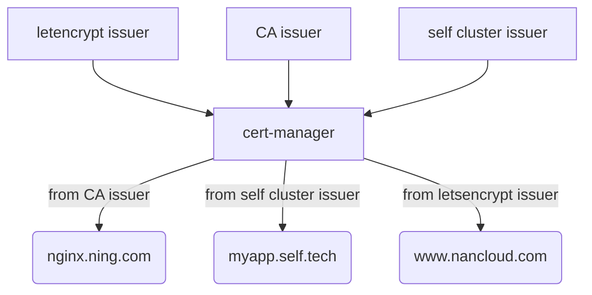

# comment
- [comment](#comment)
    - [架构](#架构)
    - [安装](#安装)
      - [创建资源](#创建资源)
      - [检查](#检查)
    - [配置](#配置)
      - [CA](#ca)
        - [创建根证书](#创建根证书)
        - [创建签发机构](#创建签发机构)
        - [创建证书](#创建证书)
        - [ingress使用证书](#ingress使用证书)
      - [自签名证书](#自签名证书)
        - [创建自签名证书Issuer](#创建自签名证书issuer)
        - [<span id="jump">生成证书</span>](#生成证书)
      - [letsencrypt](#letsencrypt)
        - [创建资源clusterissuer](#创建资源clusterissuer)
        - [生成证书](#生成证书-1)
    - [验证](#验证)

### 架构




### 安装

#### 创建资源

- 创建crd

```bash
# Kubernetes 1.15+
$ kubectl apply --validate=false -f https://github.com/jetstack/cert-manager/releases/download/v0.14.0/cert-manager.crds.yaml

```

- helm安装

```bash
# 添加helm repo
$ helm repo add jetstack https://charts.jetstack.io

# Helm v3+
$ helm install \
  cert-manager jetstack/cert-manager \
  --namespace cert-manager \
  --version v0.14.0

# Helm v2
$ helm install \
  --name cert-manager \
  --namespace cert-manager \
  --version v0.14.0 \
  jetstack/cert-manager
```

#### 检查

```bash
$ kubectl get pod -n cert-manager
NAME                                       READY   STATUS    RESTARTS   AGE
cert-manager-845c74ff94-5mdkk              1/1     Running   0          5h15m
cert-manager-cainjector-648dd444df-h7jh5   1/1     Running   0          5h15m
cert-manager-webhook-6dbcd48f9c-shh7z      1/1     Running   0          5h15m
```


### 配置

#### CA

手动创建根证书和私钥，或者从其他地方获取根证书及私钥。将证书存储在k8s的secret中，用来颁发证书，可以用内部的CA证书信任生成的签名证书。

##### 创建根证书

- openssl生成密钥及证书

```bash
$ openssl genrsa -out ca.key 2048
$ openssl req -x509 -new -nodes -key ca.key -subj "/CN=hqtest" -days 3650 -reqexts v3_req -extensions v3_ca -out ca.crt
```

- 导入k8s的secret

```bash
$ kubectl create secret tls ca-key-pair \
   --cert=ca.crt \
   --key=ca.key \
   --namespace=default
```

##### 创建签发机构

- 创建issuer,

  Issuer 只能用来签发自己所在 namespace 下的证书，ClusterIssuer 可以签发任意 namespace 下的证书,类似k8s中role和clusterrole

```bash
$ cat issuer.yaml 
apiVersion: cert-manager.io/v1alpha2
kind: Issuer
metadata:
  name: ca-issuer
  namespace: default
spec:
  ca:
    secretName: ca-key-pair
```

​    创建资源

```bash
$ kubectl apply -f issuer.yaml
```

##### 创建证书

- 创建certtificate

  cert-manager 给提供了 Certificate 这个用于生成证书的自定义资源对象，但它必须在某个namespace下

```bash
$ cat certs.yaml 
apiVersion: cert-manager.io/v1alpha2
kind: Certificate
metadata:
  name: example-com
  namespace: default
spec:
  secretName: example-com-tls
  issuerRef:
    name: ca-issuer
    kind: Issuer
  commonName: ning.com
  organization:
  - CA
  dnsNames:
  - ning.com
  - nginx.ning.com

```

​    创建资源

```bash
$ kubectl apply -f certs.yaml
```

##### ingress使用证书

- 创建一个nginx例子

```bash
$ cat nginx.yaml 
apiVersion: apps/v1
kind: Deployment
metadata:
  name: my-nginx
spec:
  replicas: 1
  selector:
    matchLabels:
      run: nginx
  template:
    metadata:
      labels:
        run: my-nginx
    spec:
      containers:
      - name: my-nginx
        image: nginx
        ports:
        - containerPort: 80
---
apiVersion: v1
kind: Service
metadata:
  name: my-nginx
  labels:
    app: my-nginx
spec:
  ports:
  - port: 80
    protocol: TCP
    name: http
  selector:
    run: my-nginx
---
apiVersion: extensions/v1beta1
kind: Ingress
metadata:
  name: my-nginx
  annotations:
    kubernetes.io/ingress.class: "nginx"
    kubernetes.io/tls-acme: "true"
    certmanager.k8s.io/issuer: "ca-issuer"
spec:
  rules:
  - host: nginx.ning.com
    http:
      paths:
      - backend:
          serviceName: my-nginx
          servicePort: 80
        path: /
  tls:
  - secretName: nginx-secret
    hosts:
    - nginx.ning.com
```

​    创建资源

```bash
$ kubectl apply -f nginx.yaml 
```

#### 自签名证书

##### 创建自签名证书Issuer

```bash
$ cat cert-resource.yaml
apiVersion: v1
kind: Namespace
metadata:
  name: cert-manager-test
---
apiVersion: cert-manager.io/v1alpha2
kind: Issuer
metadata:
  name: test-selfsigned
  namespace: cert-manager-test
spec:
  selfSigned: {}

```

​    创建资源

```bash
$ kubectl apply -f cert-resource.yaml
```

##### <span id="jump">生成证书</span>

- 手动生成

```bash
$ cat certificate-example-com.yaml
apiVersion: cert-manager.io/v1alpha2
kind: Certificate
metadata:
  name: selfsigned-cert
  namespace: cert-manager-test
spec:
  dnsNames:
    - example.com
  secretName: selfsigned-cert-tls
  issuerRef:
    name: test-selfsigned
```

​    创建资源

```bash
$ kubectl apply -f certificate-example-com.yaml
```

- 自动生成

```bash
[root@node1 selfsigne]# cat nginx-self.yaml 
apiVersion: apps/v1
kind: Deployment
metadata:
  name: myapp-deploy
  namespace: cert-manager-test
spec:
  replicas: 1
  selector:
    matchLabels:
      app: myapp
      release: canary
  template:
    metadata:
      labels:
        app: myapp
        release: canary
    spec:
      containers:
      - name: myapp
        image: ikubernetes/myapp:v1
        ports:
        - name: http
          containerPort: 80
---
apiVersion: v1
kind: Service
metadata:
  name: myapp
  namespace: cert-manager-test
spec:
  selector:
    app: myapp
    release: canary
  ports:
  - name: http
    port: 80 
    targetPort: 80 # pod port
---
apiVersion: extensions/v1beta1
kind: Ingress
metadata:
  name: ingress-myapp
  namespace: cert-manager-test
  annotations:
    kubernetes.io/ingress.class: nginx
    cert-manager.io/issuer: test-selfsigned
    kubernetes.io/tls-acme: "true"
spec:
  rules:
  - host: myapp.self.tech
    http:
      paths:
      - path: /
        backend:
          serviceName: myapp
          servicePort: 80
  tls:
  - hosts:
    - myapp.self.tech
    secretName: myapp
```

​    创建资源

```bash
$ kubectl apply -f nginx-self.yaml
```

> 注意: 1. 自动创建证书中，标记ingress参数metadata.annotations.cert-manager.io/issuer: test-selfsigned,test-selfsigned为issuer名称
>
>          2. 若使用clusterissuer则参数为 metadata.annotations.cert-manager.io/cluster-issuer

#### letsencrypt

##### 创建资源clusterissuer

```bash
$ cat clusterissuer.yaml 
apiVersion: cert-manager.io/v1alpha2
kind: ClusterIssuer
metadata:
  name: letsencrypt-prod
spec:
  acme:
    server: https://acme-v02.api.letsencrypt.org/directory
    email: 845789131@qq.com
    privateKeySecretRef:
      name: letsencrypt-prod
    solvers:
    - http01:
        ingress:
          class: nginx
```

##### 生成证书

生成证书方式和其他方式类似，可手动生成，也可以ingress自动生成，参考上节[生成证书](#jump)

> 注意：1.letsencrypt通过acme协议自动申请证书，其中包含两个sloving Challenge: http01,dns01,主要用来证明域名是属于你所有。
>
> 2. http01的校验原理是给你域名指向的 HTTP 服务增加一个临时 location ，`Let’s Encrypt` 会发送 http 请求到 `http:///.well-known/acme-challenge/`，`YOUR_DOMAIN` 就是被校验的域名，`TOKEN`是 ACME 协议的客户端负责放置的文件，在这里 ACME 客户端就是 cert-manager，它通过修改 Ingress 规则来增加这个临时校验路径并指向提供 `TOKEN` 的服务。此方法仅适用于给使用 Ingress 暴露流量的服务颁发证书，并且不支持泛域名证书。
> 3. dns01 的校验原理是利用 DNS 提供商的 API Key 拿到你的 DNS 控制权限， 在 Let’s Encrypt 为 ACME 客户端提供令牌后，ACME 客户端 (cert-manager) 将创建从该令牌和您的帐户密钥派生的 TXT 记录，并将该记录放在 `_acme-challenge.`。 然后 Let’s Encrypt 将向 DNS 系统查询该记录，如果找到匹配项，就可以颁发证书。此方法不需要你的服务使用 Ingress，并且支持泛域名证书。
>
> ​            

### 验证

- 查看ingress-controller访问方式

```bash
$ kubectl get svc -n ingress-nginx
NAME            TYPE       CLUSTER-IP      EXTERNAL-IP   PORT(S)                      AGE
ingress-nginx   NodePort   10.233.21.195   <none>        80:30773/TCP,443:30762/TCP   13d
```

- 添加 /etc/hosts解析（若有内部DNS，可配置DNS）

```bash
cat /etc/hosts
3.1.20.110 nginx.ning.com
```

> 注意：由于ingress-controller是nodeport暴露方式，这里需要写k8s其中一个node的IP

- 访问url

浏览器打开访问：https://nginx.ning.com:30762

> 注意：此处端口为ingress-controller暴露的443的nodeport端口，而非80


官网介绍： https://cert-manager.io/docs/configuration/acme/

