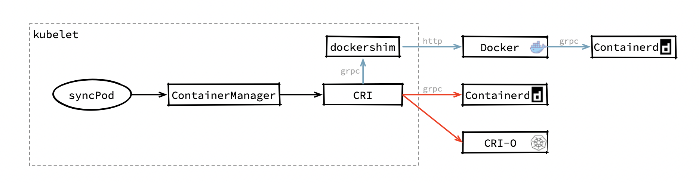

# comment

## 1. kubelet如何使用容器运行时



在早期 rkt 和 docker 争霸时，kubelet 中需要维护两坨代码分别来适配 docker 和 rkt ，这使得 kubelet 每次发布新功能都需要考虑对运行时组件的适配问题，严重拖慢了新版本发布速度。

容器运行时可能未来越来越多，如果出现新的运行时，kubelet可能还需要适配新的运行时。于是2016年，k8s提出来容器运行时接口CRI（container Runtime Interface）。CRI是对容器操作的一组抽象，只要容器运行时实现了这个接口，kubelet就能通过这个接口来适配他。不过，docker并没有实现这个接口，似乎也不打算实现这个接口，kubelet只能在内部维护一个称之为`docker-shim`组件，这个组件充当了docker和CRI的转接器，kubelet在创建容器时通过CRI调用`docker-shim`，而`docker-shim`再通过http把请求转给docker。

> 注意: 现版本docker中，已经使用containerd作为底层容器运行时

所以，若改用containerd替代docker，则kubelet创建容器的调用链如红色所示。可以直接通过一次`grpc`调用containerd。

通过上面可知k8s要删除docker是可以理解的一部分了。
> 其实这是谁胳膊粗的问题，若docker的用户多，且大家都使用，估计也不会剔除它


## 2. 迁移kubelet容器运行时

### 2.1 关闭节点服务

关闭相关服务
```bash


systemctl stop kubelet
systemctl stop docker
systemctl stop containerd
```

由于新版本中的docker在安装时默认使用`containerd`做为后端容器运行时，故不需要再安装`containerd`

### 2.2 修改containerd的plugin

containerd中默认已经实现了cri，但是以plugin的形式。在默认安装的过程中，这个plugin一般是disable状态，需要将其开启

```bash

# 将其注释掉
#disabled_plugins = ["cri"]

version = 2
[plugins."io.containerd.grpc.v1.cri"]
  sandbox_image = "registry.cn-qingdao.aliyuncs.com/huaqiangk8s/pause:3.2"
  [plugins."io.containerd.grpc.v1.cri".containerd]
    default_runtime_name = "runc"
    [plugins."io.containerd.grpc.v1.cri".containerd.runtimes.runc]
      runtime_type = "io.containerd.runc.v2"
      [plugins."io.containerd.grpc.v1.cri".containerd.runtimes.runc.options]
        SystemdCgroup = true
```

```bash
systemctl start containerd
```

### 2.2 安装配置crictl客户端工具

下载工具
```bash
wget https://github.com/kubernetes-sigs/cri-tools/releases/download/v1.19.0/crictl-v1.19.0-linux-amd64.tar.gz
tar -xzvf crictl-v1.19.0-linux-amd64.tar.gz 
mv crictl /usr/local/bin/
```

配置
修改配置文件 `/etc/crictl.yaml`
```bash
root@node6 lib]# cat /etc/crictl.yaml 
runtime-endpoint: unix:///var/run/containerd/containerd.sock
image-endpoint: unix:///var/run/containerd/containerd.sock
timeout: 10
debug: true
```

测试使用
```bash
[root@node6 lib]# crictl pods
DEBU[0000] get runtime connection                       
DEBU[0000] connect using endpoint 'unix:///var/run/containerd/containerd.sock' with '10s' timeout 
POD ID              CREATED             STATE               NAME                                              NAMESPACE           ATTEMPT             RUNTIME
```

### 2.3 修改kubelet启动参数

查看kubelet启动方式，添加启动参数

```bash
--container-runtime=remote
--container-runtime-endpoint=unix:///var/run/containerd/containerd.sock
```

重启kubelet
```bash
systemctl restart kubelet
```

查看相关节点的`CONTAINER-RUNTIME`是否已经修改
```
[root@node1 ~]# kubectl get no -o wide
NAME    STATUS   ROLES    AGE   VERSION   INTERNAL-IP   EXTERNAL-IP   OS-IMAGE                KERNEL-VERSION               CONTAINER-RUNTIME
node1   Ready    master   61d   v1.18.9   3.1.20.120    <none>        CentOS Linux 7 (Core)   5.9.1-1.el7.elrepo.x86_64    docker://19.3.13
node2   Ready    master   61d   v1.18.9   3.1.20.121    <none>        CentOS Linux 7 (Core)   5.9.1-1.el7.elrepo.x86_64    containerd://1.3.7
node3   Ready    master   61d   v1.18.9   3.1.20.122    <none>        CentOS Linux 7 (Core)   5.9.1-1.el7.elrepo.x86_64    docker://19.3.13
node4   Ready    <none>   61d   v1.18.9   3.1.20.123    <none>        CentOS Linux 7 (Core)   5.9.1-1.el7.elrepo.x86_64    docker://19.3.13
node5   Ready    <none>   61d   v1.18.9   3.1.20.124    <none>        CentOS Linux 7 (Core)   5.9.1-1.el7.elrepo.x86_64    docker://19.3.13
node6   Ready    <none>   61d   v1.18.9   3.1.20.125    <none>        CentOS Linux 7 (Core)   3.10.0-1160.6.1.el7.x86_64   containerd://1.4.3
```